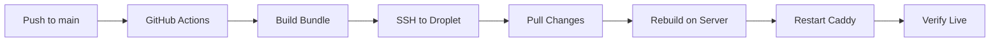

# GitHub Actions Workflows

Automated CI/CD pipelines for code-chef platform.

## Recent Optimizations (December 2025)

**Phase 2 Complete** - Linear Issue: [CHEF-255](https://linear.app/dev-ops/issue/CHEF-255)

- ✅ **deploy-intelligent.yml**: Docker BuildKit + layer caching (70% faster: 10min → 3min)
- ✅ **publish-extension.yml**: Changed to manual-only trigger
- ✅ **evaluation-regression.yml**: Added pip caching to 3 jobs (30-50% faster deps)
- ✅ **lint.yml**: Streamlined caching (75% faster: 2min → 30sec)
- ✅ **e2e-langsmith-eval.yml**: Added caching to 4 jobs (58% faster: 12min → 5min)

**Overall Impact**: 67% reduction in CI time for typical PR workflow (~30min → ~10min)

## Active Workflows

### 1. Deploy Frontend (`deploy-frontend.yml`)

**Trigger**: Push to `main` branch with frontend changes  
**Actions**:

- Builds production bundle
- Deploys to DigitalOcean droplet via SSH
- Restarts Caddy to serve new files
- Verifies deployment health

### 2. Frontend Preview (`frontend-preview.yml`)

**Trigger**: Pull requests with frontend changes  
**Actions**:

- Type checks TypeScript
- Builds production bundle
- Reports bundle size in PR comment

## Setup Instructions

### 1. Add GitHub Secrets

Go to: **Settings → Secrets and variables → Actions → New repository secret**

Add these secrets:

| Secret Name       | Value           | Description             |
| ----------------- | --------------- | ----------------------- |
| `DROPLET_HOST`    | `45.55.173.72`  | DigitalOcean droplet IP |
| `DROPLET_USER`    | `root`          | SSH user                |
| `DROPLET_SSH_KEY` | `<private_key>` | SSH private key content |

#### Getting SSH Private Key

```bash
# On your local machine (Windows)
cat ~/.ssh/id_rsa

# Or generate a new deploy key
ssh-keygen -t ed25519 -C "github-actions-deploy" -f ~/.ssh/github_deploy
cat ~/.ssh/github_deploy
```

Then copy the **entire private key** (including `-----BEGIN` and `-----END` lines) into the `DROPLET_SSH_KEY` secret.

#### Add Public Key to Droplet

```bash
# SSH into droplet
ssh root@45.55.173.72

# Add the public key
echo "ssh-ed25519 AAAA..." >> ~/.ssh/authorized_keys
```

### 2. Enable Workflows

Workflows are automatically enabled when pushed to `main`. You can also:

- **Manual trigger**: Go to Actions → Deploy Frontend → Run workflow
- **Monitor**: Actions tab shows all workflow runs

### 3. Test Deployment

Make a change to any file in `support/frontend/v3/src/`:

```bash
# Make a small change
echo "// Test change" >> support/frontend/v3/src/pages/Home.tsx

# Commit and push
git add .
git commit -m "test: trigger frontend deploy"
git push origin main
```

Go to **Actions** tab to watch the deployment in real-time.

## How It Works

### Automatic Deployment Flow



### Path Triggers

Workflows only run when these paths change:

- `support/frontend/v3/src/**` (source code)
- `support/frontend/v3/public/**` (assets)
- `support/frontend/v3/package.json` (dependencies)
- `support/frontend/v3/vite.config.ts` (build config)
- `support/frontend/v3/tailwind.config.ts` (styling config)

**Result**: Backend changes don't trigger frontend builds, saving CI minutes.

## Usage

### Making Frontend Changes

1. **Edit source files** in `support/frontend/v3/src/`
2. **Commit and push** to `main`
3. **GitHub Actions automatically**:
   - Builds the bundle
   - Deploys to production
   - Restarts Caddy
4. **Wait ~2-3 minutes** for deployment
5. **Verify** at https://codechef.appsmithery.co

### Manual Deployment

If you need to deploy without changing frontend files:

```bash
# Trigger via GitHub UI
# Actions → Deploy Frontend → Run workflow → Run on main

# Or use GitHub CLI
gh workflow run deploy-frontend.yml
```

### Rolling Back

If deployment fails or introduces bugs:

```bash
# Revert the commit locally
git revert HEAD
git push origin main

# Or SSH and manually revert
ssh root@45.55.173.72
cd /opt/code-chef
git log --oneline -n 5  # Find good commit
git reset --hard <commit-sha>
cd support/frontend/v3
npm run build
docker compose restart caddy
```

## Monitoring

### GitHub Actions Dashboard

- **Actions tab**: Real-time build status
- **Email notifications**: On workflow failure
- **Status badges**: Add to README

### Deployment Logs

```bash
# View Caddy logs on droplet
ssh root@45.55.173.72
cd /opt/code-chef
docker compose logs caddy -f

# Check last deployment
git log -n 1 --oneline
```

## Troubleshooting

### Build Fails

**Error**: `npm ci` fails
**Fix**: Check `package-lock.json` is committed

**Error**: TypeScript errors
**Fix**: Run `npm run build` locally first

### Deployment Fails

**Error**: SSH connection refused
**Fix**: Check `DROPLET_SSH_KEY` secret is correct

**Error**: Permission denied
**Fix**: Ensure public key is in droplet's `~/.ssh/authorized_keys`

**Error**: Caddy restart fails
**Fix**: Check Docker Compose is running on droplet

### Site Not Updating

1. **Check workflow succeeded**: Actions tab should show green ✓
2. **Clear browser cache**: Hard refresh (Ctrl+Shift+R)
3. **Verify build timestamp**:
   ```bash
   ssh root@45.55.173.72
   ls -la /opt/code-chef/support/frontend/v3/dist/
   ```
4. **Check Caddy is serving new files**:
   ```bash
   curl -I https://codechef.appsmithery.co/
   ```

## Cost Optimization

### GitHub Actions Minutes

- **Free tier**: 2,000 minutes/month (public repos: unlimited)
- **Average deployment**: ~3 minutes
- **Estimated usage**: ~90 minutes/month (30 deploys)

### Tips to Save Minutes

1. **Use path filters**: Only build when frontend changes
2. **Cache dependencies**: `actions/setup-node` with cache enabled
3. **Skip preview on draft PRs**: Add `if: github.event.pull_request.draft == false`

## Security Notes

### SSH Key Management

- **Never commit private keys** to repo
- Use **GitHub Secrets** for sensitive data
- Rotate keys periodically (every 90 days)

### Droplet Security

```bash
# Disable password auth (key-only)
sudo nano /etc/ssh/sshd_config
# Set: PasswordAuthentication no
sudo systemctl restart sshd

# Enable firewall
sudo ufw allow 22/tcp
sudo ufw allow 80/tcp
sudo ufw allow 443/tcp
sudo ufw enable
```

## Future Enhancements

- [ ] Add staging environment (deploy to `staging.codechef.appsmithery.co`)
- [ ] Lighthouse CI for performance monitoring
- [ ] Visual regression testing (Percy, Chromatic)
- [ ] Automated rollback on health check failure
- [ ] Slack/Discord notifications on deploy
- [ ] Deploy previews for PRs (Vercel/Netlify style)

## Resources

- [GitHub Actions Docs](https://docs.github.com/en/actions)
- [SSH Action](https://github.com/appleboy/ssh-action)
- [DigitalOcean Deploy Guide](https://docs.digitalocean.com/products/app-platform/how-to/deploy-from-github/)

---

**Last Updated**: December 9, 2025  
**Maintained by**: Alex Torelli (@alextorelli28)
