# code/chef — Your AI Development Team

[](https://marketplace.visualstudio.com/items?itemName=appsmithery.vscode-codechef)
[](https://www.langchain.com/langgraph)
[](https://openrouter.ai)
[](LICENSE)

> **Talk to your code. Ship faster.**

code/chef is an AI-powered development team that lives in VS Code. Just type `@chef` in Copilot Chat and describe what you want—feature implementation, code reviews, infrastructure setup, CI/CD pipelines, or documentation. The AI team handles the rest.

---

## 🎮 Command Structure

code/chef supports two interaction modes:

### 💬 Ask Mode (Conversational)

Chat naturally with the AI—no commands needed. Great for questions, explanations, and discussions.

```
@chef how does authentication work in this codebase?
@chef what's the best way to structure this feature?
@chef explain this code to me
```

### ⚡ Agent Mode (Task Execution)

Use `/execute` for tasks that require actual work. Creates Linear issues for tracking.

```
@chef /execute implement JWT authentication
@chef /execute review security of auth/login.py
@chef /execute deploy to staging environment
```

**Available Commands**:

- `/execute <task>` — Submit task for agent execution (creates Linear issue)
- `/help` — Show command reference
- `/status <workflow_id>` — Check workflow status
- `/cancel <workflow_id>` — Cancel running workflow

💡 **Tip**: If you forget to use `/execute` for a task, code/chef will remind you!

**Migration Guide**: [Command Gating Migration](support/docs/COMMAND-GATING-MIGRATION.md)

---

## ✨ What Can code/chef Do?

### 🚀 Build Features

```
@chef /execute Add user authentication with JWT tokens and password reset
```

The Feature Dev agent writes production-ready code with tests.

### 🔍 Review Code

```
@chef /execute Review this PR for security vulnerabilities
```

The Code Review agent analyzes for security issues, performance, and best practices.

### 🏗️ Set Up Infrastructure

```
@chef /execute Create a Docker Compose setup for my Node.js app with PostgreSQL
```

The Infrastructure agent generates Dockerfiles, compose files, and Terraform configs.

### ⚡ Automate Pipelines

```
@chef /execute Create a GitHub Actions workflow for testing and deployment
```

The CI/CD agent builds your pipelines across GitHub Actions, GitLab CI, Jenkins, and more.

### 📚 Write Documentation

```
@chef /execute Document the API endpoints in this codebase
```

The Documentation agent creates README files, API docs, and architecture diagrams.

### 🤖 Train & Deploy Models (ModelOps)

```
@chef /execute Train a fine-tuned model for the Feature Dev agent
```

The Infrastructure agent handles the complete model lifecycle:

- **Training**: Fine-tune models on your codebase via HuggingFace AutoTrain
- **Evaluation**: Compare candidates vs baseline with 5 metrics (accuracy, completeness, efficiency, latency, integration)
- **Deployment**: Update agent models safely with automatic rollback
- **A/B Testing**: Measure improvement with comprehensive experiment tracking

**VS Code Commands**:

- `codechef.modelops.train` — Start training wizard with cost estimation
- `codechef.modelops.evaluate` — Evaluate model performance with LangSmith
- `codechef.modelops.deploy` — Deploy model to agent (30s process)
- `codechef.modelops.rollback` — Rollback to previous version (<60s)
- `codechef.modelops.modelVersions` — View deployment history

**Training Modes**:

| Mode       | Cost  | Duration | Use Case         |
| ---------- | ----- | -------- | ---------------- |
| Demo       | $0.50 | 5 min    | Quick validation |
| Production | $3.50 | 60 min   | Full training    |

See [LLM Operations Guide](support/docs/operations/LLM_OPERATIONS.md) for complete documentation.

---

## 🎯 Why code/chef?

| Traditional Workflow          | With code/chef               |
| ----------------------------- | ---------------------------- |
| Switch between 5+ tools       | One chat interface           |
| Copy-paste context everywhere | AI understands your codebase |
| Wait for code reviews         | Instant AI analysis          |
| Manual documentation          | Auto-generated docs          |
| Complex CI/CD setup           | Plain English commands       |

### 🧠 Smart Model Selection

code/chef automatically picks the right AI model for each task via OpenRouter:

| Task            | Model              | Cost/1M | Why                            |
| --------------- | ------------------ | ------- | ------------------------------ |
| Orchestration   | Claude 3.5 Sonnet  | $3.00   | Best reasoning for routing     |
| Code Generation | Qwen 2.5 Coder 32B | $0.07   | Purpose-built for coding       |
| Code Review     | DeepSeek V3        | $0.75   | Excellent analytical reasoning |
| Infrastructure  | Gemini 2.0 Flash   | $0.25   | Fast, 1M context for IaC       |
| CI/CD           | Gemini 2.0 Flash   | $0.25   | Great at YAML generation       |
| Documentation   | DeepSeek V3        | $0.75   | Strong technical writing       |

### 🏗️ Architecture Overview

```mermaid
flowchart TB
    subgraph VSCode["🖥️ VS Code"]
        Chat["@chef Add JWT auth to my Express API"]
    end

    subgraph Orchestrator["🧑‍🍳 code/chef Orchestrator"]
        Supervisor["Supervisor\n(Head Chef)"]

        subgraph Agents["Specialized Agents"]
            FeatureDev["🚀 Feature Dev"]
            CodeReview["🔍 Code Review"]
            CICD["⚡ CI/CD"]
            Infra["🏗️ Infrastructure"]
            Docs["📚 Documentation"]
        end

        Tools["🔧 150+ MCP Tools"]
    end

    subgraph Integrations["External Services"]
        GitHub["🐙 GitHub"]
        Linear["📋 Linear"]
        Docker["🐳 Docker"]
        Metrics["📊 Metrics"]
    end

    Chat --> Supervisor
    Supervisor --> FeatureDev
    Supervisor --> CodeReview
    Supervisor --> CICD
    Supervisor --> Infra
    Supervisor --> Docs

    FeatureDev --> Tools
    CodeReview --> Tools
    CICD --> Tools
    Infra --> Tools
    Docs --> Tools

    Tools --> GitHub
    Tools --> Linear
    Tools --> Docker
    Tools --> Metrics
```



---

## 🚀 Get Started in 2 Minutes

### Install the VS Code Extension

> **⚠️ Authentication Required**: Access to this extension is controlled via GitHub Packages to prevent unauthorized LLM usage until metered accounts are implemented.

**Install via npx** (requires GitHub token with `read:packages` scope):

```bash
# Setup authentication (first time only)
echo "@appsmithery:registry=https://npm.pkg.github.com" >> ~/.npmrc
echo "//npm.pkg.github.com/:_authToken=YOUR_GITHUB_TOKEN" >> ~/.npmrc

# Install extension
npx @appsmithery/vscode-codechef
```

**Alternative**: Download VSIX from [GitHub Releases](https://github.com/Appsmithery/code-chef/releases) and install manually.

See [Quick Start Guide](support/docs/getting-started/QUICK_START.md) for self-hosting options.

---

## 💬 Example Conversations

### Feature Development

```

You: @chef Build a REST API for managing blog posts with CRUD operations

Chef: I'll create a complete blog API with:

- Express routes for posts (GET, POST, PUT, DELETE)
- PostgreSQL database schema
- Input validation
- Error handling
- Unit tests

[Creates files, runs tests, opens PR]

```

### Code Review

```

You: @chef Check my authentication code for security issues

Chef: I found 3 issues:
🔴 Critical: Password stored in plain text (line 45)
🟡 Warning: Missing rate limiting on login endpoint
🟢 Suggestion: Consider adding CSRF protection

[Links to specific lines with fix suggestions]

```

### Infrastructure Setup

```

You: @chef Set up Kubernetes deployment for my microservices

Chef: I'll create:

- Deployment manifests for each service
- ConfigMaps and Secrets
- Horizontal Pod Autoscaler
- Ingress configuration

[Generates YAML files with best practices]

```

---

## 🔧 Slash Commands

| Command                  | What it does                 |
| ------------------------ | ---------------------------- |
| `@chef <task>`           | Execute any development task |
| `@chef /status`          | Check current task progress  |
| `@chef /workflow <name>` | Run a specific workflow      |
| `@chef /tools`           | See available integrations   |

---

## 🔌 Integrations

code/chef connects to your existing tools:

- **GitHub** — PRs, issues, actions
- **Linear** — Project management, approvals
- **Docker** — Container management
- **Databases** — PostgreSQL, Redis
- **Cloud** — DigitalOcean, AWS (coming)

---

## 🏢 Self-Hosting

Want full control? Run your own code/chef instance.

```bash
git clone https://github.com/Appsmithery/code-chef.git
cd code-chef && cp config/env/.env.template config/env/.env
# Add your API keys to .env
cd deploy && docker-compose up -d
```

See [Quick Start Guide](support/docs/getting-started/QUICK_START.md) for detailed setup.

---

## 📖 Documentation

| Guide                                                                  | Description                 |
| ---------------------------------------------------------------------- | --------------------------- |
| [Quick Start](support/docs/getting-started/QUICK_START.md)             | Installation & first steps  |
| [Architecture](support/docs/architecture-and-platform/ARCHITECTURE.md) | How it works under the hood |
| [Deployment](support/docs/getting-started/DEPLOYMENT.md)               | Production setup            |

---

## 🤝 Contributing

1. Fork the repository
2. Create feature branch: `git checkout -b feature/amazing-feature`
3. Commit changes: `git commit -m 'Add amazing feature'`
4. Push: `git push origin feature/amazing-feature`
5. Open Pull Request

---

## 📄 License

MIT License — see [LICENSE](LICENSE)

---

## 🔗 Links

- [VS Code Extension](https://marketplace.visualstudio.com/items?itemName=appsmithery.vscode-codechef)
- [GitHub Repository](https://github.com/Appsmithery/code-chef)
- [Linear Project](https://linear.app/dev-ops/project/codechef-78b3b839d36b)

- [LangSmith Traces](https://smith.langchain.com)
- [Grafana Metrics](https://appsmithery.grafana.net)

---

**Built with** ❤️ **using LangGraph, MCP, and VS Code**
