# code/chef — Your AI Development Team

[](https://marketplace.visualstudio.com/items?itemName=appsmithery.vscode-codechef)
[](https://marketplace.visualstudio.com/items?itemName=appsmithery.vscode-codechef)
[](https://marketplace.visualstudio.com/items?itemName=appsmithery.vscode-codechef)
[](LICENSE)

> **Talk to your code. Ship faster.**

code/chef is like having an experienced development team right in VS Code. Just chat naturally about what you want to build—new features, code reviews, documentation, deployment setups—and the AI handles the heavy lifting while you focus on the creative work.

---

## ✨ What Can code/chef Do?

### 🚀 Build Features

```
@chef Add user login with email and password reset
```

Get complete, working code for new features—no need to know all the technical details.

### 🔍 Review Your Code

```
@chef Check this code for issues
```

Get instant feedback on security problems, performance issues, or just general improvements.

### 🏗️ Set Up Your Project

```
@chef Set up Docker for my app with a database
```

Get all the configuration files you need without learning Docker syntax.

### ⚡ Automate Deployments

```
@chef Create a workflow to test and deploy my app
```

Automate your testing and deployment without wrestling with YAML files.

### 📚 Generate Documentation

```
@chef Write documentation for my API
```

Get professional docs written for you—README files, API guides, whatever you need.

---

## 🎯 Why code/chef?

| Without code/chef           | With code/chef              |
| --------------------------- | --------------------------- |
| Switch between many tools   | Everything in one chat      |
| Search for solutions        | Just describe what you want |
| Wait hours for code reviews | Get instant feedback        |
| Write docs manually         | Generated automatically     |
| Complex setup processes     | Plain English requests      |
| Solo development struggles  | AI team always available    |

### 🧠 Always Uses the Right AI

code/chef automatically picks the best AI for each task—you don't need to worry about which model to use. Different tasks get different specialists, just like a real team.

### 🎯 Smart Task Routing

6 specialized agents handle your requests with expert precision:

```mermaid
graph LR
    User[👤 You] --> Supervisor[🎩 Supervisor]
    Supervisor --> FeatureDev[💻 Feature Dev]
    Supervisor --> CodeReview[🔍 Code Review]
    Supervisor --> Infrastructure[🏗️ Infrastructure]
    Supervisor --> CICD[🚀 CI/CD]
    Supervisor --> Documentation[📚 Documentation]

    FeatureDev --> Tools[178+ MCP Tools]
    CodeReview --> Tools
    Infrastructure --> Tools
    CICD --> Tools
    Documentation --> Tools
```



### 💰 90% Lower Token Costs

Progressive tool loading + semantic code search drastically reduces token waste compared to traditional approaches.

| Operation              | Traditional | code/chef | Savings |
| ---------------------- | ----------- | --------- | ------- |
| Feature implementation | ~8K tokens  | ~800      | 90%     |
| Code review            | ~5K tokens  | ~600      | 88%     |
| Documentation          | ~3K tokens  | ~400      | 87%     |

### 🧠 Learns Your Codebase

Fine-tune models on your code in ~1 hour. Test improvements automatically, deploy with confidence. (Optional - works great out of the box!)

### 🚀 Production-Ready

Secure cloud infrastructure with automatic HTTPS, health monitoring, zero-downtime deploys. Or self-host on your own infrastructure.

---

## 🆓 Pricing

> **Current Status**: Private beta testing phase

code/chef is currently in **private beta** with limited testing. The extension will transition to a paid model in 2025 with:

- **Free tier**: For personal projects and evaluation
- **Pro tier**: For professional developers with higher usage needs
- **Team tier**: For development teams with collaboration features
- **Enterprise tier**: Custom pricing with SSO and audit logging

Beta testers will receive **special early-adopter pricing** when paid plans launch.

For comprehensive documentation and updates, visit [codechef.appsmithery.co](https://codechef.appsmithery.co)

---

## 🚀 Get Started in 2 Minutes

### Step 1: Install the Extension

> **⚠️ Access Required**: This extension requires GitHub authentication to prevent unauthorized LLM usage. Contact your administrator for access.

#### **Option 1: npx (Recommended)**

Install with one command using your [GitHub Personal Access Token](https://github.com/settings/tokens/new?scopes=read:packages) with `read:packages` scope:

**Bash/Linux/macOS:**

```bash
# First time only: Setup authentication
echo "@appsmithery:registry=https://npm.pkg.github.com" >> ~/.npmrc
echo "//npm.pkg.github.com/:_authToken=YOUR_GITHUB_TOKEN" >> ~/.npmrc

# Install extension
npx @appsmithery/vscode-codechef
```

**Windows PowerShell:**

```powershell
# First time only: Setup authentication
Add-Content -Path "$env:USERPROFILE\.npmrc" -Value "@appsmithery:registry=https://npm.pkg.github.com"
Add-Content -Path "$env:USERPROFILE\.npmrc" -Value "//npm.pkg.github.com/:_authToken=YOUR_GITHUB_TOKEN"

# Install extension
npx @appsmithery/vscode-codechef
```

#### **Option 2: Manual from Administrator**

**Bash/Linux/macOS:**

```bash
curl -L https://github.com/Appsmithery/code-chef/releases/latest/download/vscode-codechef-1.0.0.vsix -o codechef.vsix && code --install-extension codechef.vsix
```

**PowerShell/Windows:**

```powershell
curl -L https://github.com/Appsmithery/code-chef/releases/latest/download/vscode-codechef-1.0.0.vsix -o codechef.vsix; code --install-extension codechef.vsix
```

Or manually:

1. Go to [Releases](https://github.com/Appsmithery/code-chef/releases)
2. Download the latest `vscode-codechef-*.vsix` file
3. In VS Code: `Ctrl+Shift+P` → **Extensions: Install from VSIX...**
4. Select the downloaded file and reload VS Code

#### **Troubleshooting**

**"code command not found"**

1. Open VS Code
2. Press `Ctrl+Shift+P` (or `Cmd+Shift+P` on Mac)
3. Type "Shell Command: Install 'code' command in PATH"
4. Retry installation

**"Authentication required" (npx)**

This is intentional. Contact your administrator for:

- GitHub Personal Access Token with `read:packages` scope
- Access to the GitHub Packages repository

**"VSIX not found in package" (npx)**

The npm package downloads the VSIX from GitHub releases automatically. If this fails:

- Check your internet connection
- Manually download from [Releases](https://github.com/Appsmithery/code-chef/releases) (Option 3)

**"Extension activation failed"**

1. Check VS Code version: Must be >= 1.85.0
2. Update VS Code: Help → Check for Updates
3. Restart VS Code after installation

### Step 2: Set Up Your API Key

1. Press `Ctrl+Shift+P` (or `Cmd+Shift+P` on Mac)
2. Type "code/chef: Configure" and press Enter
3. Enter your API key (ask your team admin, or [contact us](https://github.com/Appsmithery/code-chef) to get one)

### Step 3: Start Building

Open GitHub Copilot Chat and type:

```
@chef Build a user login page
```

That's it! Watch as code/chef creates the files, writes the code, and explains what it did.

---

## 💬 Real Conversations

### "I need to add a feature"

```
You: @chef I need users to be able to reset their passwords

Chef: I'll set up password reset for you. This will include:
- Email verification
- Secure reset tokens
- New password form
- All the security best practices

Creating the files now...
```

### "Is my code okay?"

```
You: @chef Can you check my login code?

Chef: I found a few things:
🔴 Important: Passwords aren't being encrypted (line 45)
🟡 Heads up: Login page needs rate limiting to prevent attacks
🟢 Nice to have: Add "remember me" functionality

Want me to fix these?
```

### "I'm stuck on deployment"

```
You: @chef How do I deploy this to production?

Chef: I'll create a deployment setup for you with:
- Automated testing before deploy
- Staging environment
- Easy rollback if something breaks
- Step-by-step deployment guide

Setting this up now...
```

---

## 🔧 Quick Commands

### In Chat

Just talk naturally! Here are some examples:

- `@chef <describe what you want>` — The main way to use code/chef
- `@chef /status` — See what code/chef is working on
- `@chef /tools` — See what integrations are available

### From the Command Menu

Press `Ctrl+Shift+P` (or `Cmd+Shift+P` on Mac) and search:

| Command                   | What it does                     |
| ------------------------- | -------------------------------- |
| `code/chef: Submit Task`  | Send a task without using chat   |
| `code/chef: Health Check` | Make sure everything's working   |
| `code/chef: Configure`    | Change your settings             |
| `code/chef: Clear Cache`  | Start fresh if something's stuck |

---

## 🎓 Advanced: Teach code/chef Your Style

Want code/chef to write code exactly how your team likes it? You can train custom models on your codebase. This is completely optional—code/chef works great out of the box.

### How It Works

1. **Train**: Press `Ctrl+Shift+P` → "codechef.modelops.train"

   - Takes about an hour
   - Learns from your existing code
   - Costs a few dollars

2. **Test**: Press `Ctrl+Shift+P` → "codechef.modelops.evaluate"

   - See if the new model is better
   - Get a clear recommendation

3. **Deploy**: Press `Ctrl+Shift+P` → "codechef.modelops.deploy"
   - Switch to your custom model
   - Can always switch back

**Most users don't need this.** The default models are excellent. Custom training is for teams that want code/chef to match their specific coding style perfectly.

---

## ⚙️ Settings

You probably won't need to change these, but here they are:

| Setting                        | What it does                                |
| ------------------------------ | ------------------------------------------- |
| `codechef.apiKey`              | Your API key (required)                     |
| `codechef.orchestratorUrl`     | Server location (leave as default)          |
| `codechef.showWorkflowPreview` | Show what code/chef will do before doing it |
| `codechef.useStreaming`        | Show responses as they're being written     |

Access settings: `Ctrl+Shift+P` → "code/chef: Configure"

---

## 🔌 Works With Your Tools

code/chef integrates with the tools you already use:

- **GitHub** — Creates pull requests, manages issues
- **Linear** — Updates project tasks
- **Docker** — Manages containers
- **Databases** — PostgreSQL, Redis, and more

No extra setup needed—code/chef figures out what you're using and works with it.

---

## ❓ Frequently Asked Questions

### How much does it cost?

code/chef is currently in private beta testing. Paid plans will launch in 2025 with a free tier for personal projects. Beta testers will receive special early-adopter pricing.

### What's the difference vs GitHub Copilot?

GitHub Copilot provides inline code suggestions. code/chef orchestrates **multi-agent workflows** with 6 specialized agents (feature-dev, code-review, infrastructure, cicd, documentation, supervisor), progressive tool loading (90% token savings), and ModelOps for continuous improvement. It's like having an entire dev team instead of just an autocomplete assistant.

### Can I self-host?

Yes! See [DEPLOYMENT.md](https://github.com/Appsmithery/code-chef/blob/main/support/docs/getting-started/DEPLOYMENT.md) for complete self-hosting instructions. Requires Docker and a $5/month DigitalOcean droplet (or equivalent).

### What models are used?

We use specialized models for each agent:

- **Supervisor**: Claude 3.5 Sonnet (best reasoning for complex routing)
- **Feature Dev**: Qwen 2.5 Coder 32B (purpose-built for code generation)
- **Code Review**: DeepSeek V3 (strong analytical reasoning)
- **Infrastructure/CI/CD**: Gemini 2.0 Flash (1M context window for IaC)
- **Documentation**: DeepSeek V3 (excellent technical writing)

See the [LLM Operations Guide](https://github.com/Appsmithery/code-chef/blob/main/support/docs/operations/LLM_OPERATIONS.md) for complete model selection strategy.

### How is my code kept private?

**Your code is never stored** on our servers. When using the cloud orchestrator, requests are logged for debugging (retained 7 days) but no source code is persisted. For complete data privacy, self-host the orchestrator. See [PRIVACY.md](PRIVACY.md) for full details.

### Who is code/chef for?

- **Solo developers** who want a full dev team without the overhead
- **Small teams** looking to move faster without hiring more people
- **Enterprise teams** who want consistent code quality and automated workflows
- **Anyone** who's tired of context-switching between multiple tools

---

## ❓ Something Not Working?

### code/chef isn't responding

1. Make sure you typed `@chef` at the start of your message
2. Try: `Ctrl+Shift+P` → "code/chef: Health Check"
3. Still stuck? Try: `Ctrl+Shift+P` → "code/chef: Clear Cache" and reload VS Code

### Connection issues

1. Check your API key: `Ctrl+Shift+P` → "code/chef: Configure"
2. Make sure you're connected to the internet
3. Try the health check: `Ctrl+Shift+P` → "code/chef: Health Check"

### Still having trouble?

Open an issue on [GitHub](https://github.com/Appsmithery/code-chef/issues) and we'll help you out!

---

## 📞 Get Help or Get Started

- **GitHub**: [github.com/Appsmithery/code-chef](https://github.com/Appsmithery/code-chef)
- **Issues**: Found a bug? [Open an issue](https://github.com/Appsmithery/code-chef/issues)
- **Questions**: Need help? Start a [discussion](https://github.com/Appsmithery/code-chef/discussions)

---

## 📄 License

MIT License — Free for personal and commercial use. See [LICENSE](LICENSE) for details.

---

**Made with ❤️ for developers who want to focus on building, not fighting with tools.**
