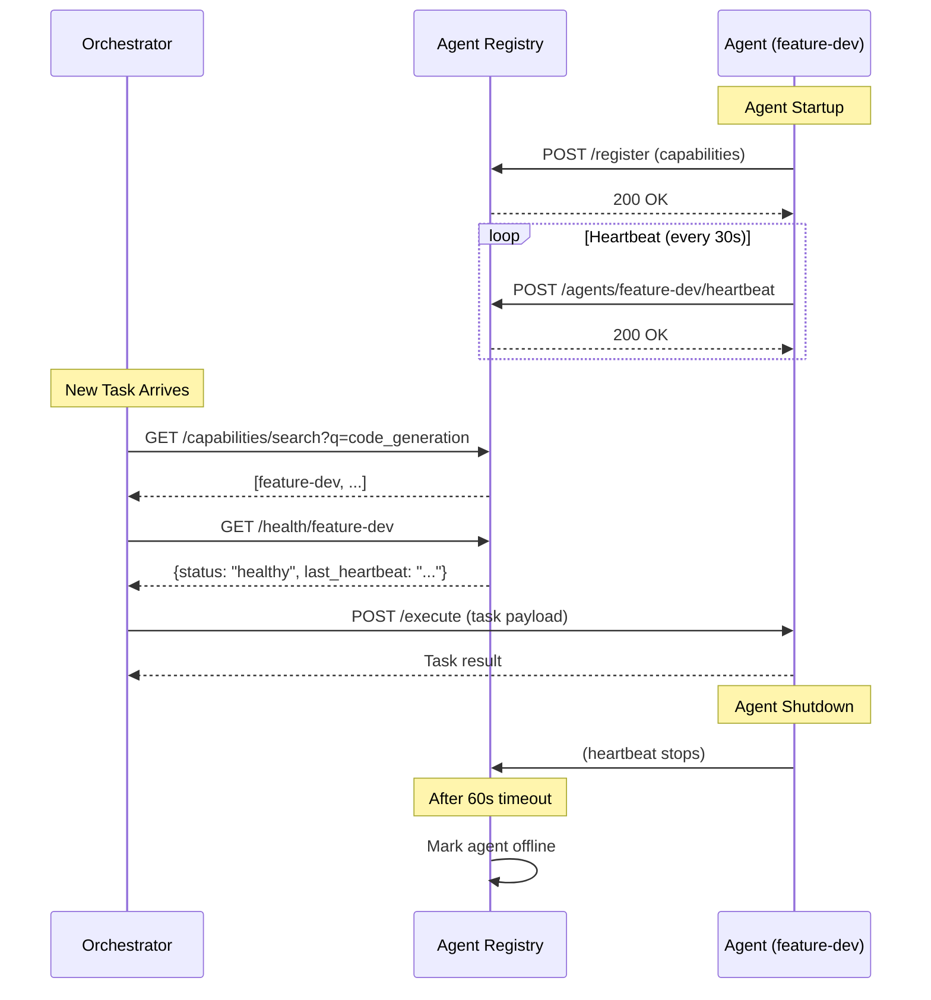

# Agent Registry Service

The Agent Registry is a centralized service that enables dynamic discovery, capability matching, and health monitoring for all agents in the Dev-Tools ecosystem.

## Architecture

- **Service**: `agent-registry` (FastAPI)
- **Port**: 8009
- **Storage**: PostgreSQL (`agent_registry` table)
- **Client**: `shared.lib.registry_client.RegistryClient`

## Features

1.  **Auto-Registration**: Agents register themselves on startup with their capabilities and metadata.
2.  **Heartbeat Monitoring**: Agents send periodic heartbeats. If a heartbeat is missed (default 60s), the agent is marked `offline`.
3.  **Capability Discovery**: Clients can search for agents based on capability keywords (e.g., "python", "security", "deployment").
4.  **Health Checks**: Provides real-time health status of agents.

## API Endpoints

| Method | Endpoint                 | Description                              |
| :----- | :----------------------- | :--------------------------------------- |
| `POST` | `/register`              | Register or update an agent              |
| `POST` | `/agents/{id}/heartbeat` | Send a heartbeat                         |
| `GET`  | `/agents`                | List all agents (optional status filter) |
| `GET`  | `/agents/{id}`           | Get agent details                        |
| `GET`  | `/capabilities/search`   | Search agents by capability              |
| `GET`  | `/health/{id}`           | Check specific agent health              |

## Integration Guide

### Registering an Agent

Agents use the `RegistryClient` to register on startup:

```python
from shared.lib.registry_client import RegistryClient, AgentCapability

client = RegistryClient(
    registry_url="http://agent-registry:8009",
    agent_id="my-agent",
    agent_name="My Custom Agent",
    base_url="http://my-agent:8000"
)

capabilities = [
    AgentCapability(
        name="code_generation",
        description="Generates Python code",
        cost_estimate="~100 tokens",
        tags=["coding", "python"]
    )
]

await client.register(capabilities)
await client.start_heartbeat()
```

### Discovering Agents

The Orchestrator (or other agents) can discover peers:

```python
# Find an agent that can do "security scanning"
matches = await client.search_capabilities("security")

if matches:
    target_agent = matches[0].agent_id
    # Delegate task to target_agent...
```

## Database Schema

See `config/state/agent_registry.sql` for the full schema definition.

```sql
CREATE TABLE agent_registry (
    agent_id VARCHAR(64) PRIMARY KEY,
    agent_name VARCHAR(128) NOT NULL,
    base_url VARCHAR(256) NOT NULL,
    status VARCHAR(32) NOT NULL,
    capabilities JSONB NOT NULL,
    last_heartbeat TIMESTAMP NOT NULL
);
```

## Complete Integration Examples

### Example 1: Agent Self-Registration on Startup

```python
# agent_feature-dev/main.py
from fastapi import FastAPI
from shared.lib.registry_client import RegistryClient, AgentCapability
import asyncio

app = FastAPI()

# Initialize registry client
registry_client = RegistryClient(
    registry_url="http://agent-registry:8009",
    agent_id="feature-dev",
    agent_name="Feature Development Agent",
    base_url="http://feature-dev:8002"
)

@app.on_event("startup")
async def startup():
    # Register capabilities
    capabilities = [
        AgentCapability(
            name="code_generation",
            description="Generates production-ready code in Python, JavaScript, TypeScript",
            cost_estimate="50-200 tokens per function",
            tags=["coding", "python", "javascript", "typescript"]
        ),
        AgentCapability(
            name="refactoring",
            description="Refactors existing code for better maintainability",
            cost_estimate="100-500 tokens per file",
            tags=["coding", "refactoring", "best-practices"]
        ),
        AgentCapability(
            name="feature_implementation",
            description="Implements new features from specifications",
            cost_estimate="500-2000 tokens per feature",
            tags=["coding", "feature", "implementation"]
        )
    ]

    await registry_client.register(capabilities)
    await registry_client.start_heartbeat(interval=30)  # Heartbeat every 30s

    print(f"✅ Agent {registry_client.agent_id} registered with {len(capabilities)} capabilities")

@app.on_event("shutdown")
async def shutdown():
    await registry_client.stop_heartbeat()
    print(f"✅ Agent {registry_client.agent_id} heartbeat stopped")
```

### Example 2: Orchestrator Discovering Agents by Capability

```python
# agent_orchestrator/main.py
from shared.lib.registry_client import RegistryClient

orchestrator_registry = RegistryClient(
    registry_url="http://agent-registry:8009",
    agent_id="orchestrator",
    agent_name="Orchestrator Agent",
    base_url="http://orchestrator:8001"
)

async def find_best_agent_for_task(task_description: str, required_capability: str):
    """Find the best agent to handle a task based on capability matching."""

    # Search for agents with the required capability
    matches = await orchestrator_registry.search_capabilities(required_capability)

    if not matches:
        raise ValueError(f"No agent found with capability: {required_capability}")

    # Filter to only active agents
    active_matches = [
        match for match in matches
        if match.status == "active"
    ]

    if not active_matches:
        raise ValueError(f"No active agent found with capability: {required_capability}")

    # Return the first active match (or implement more sophisticated selection)
    best_match = active_matches[0]

    print(f"Selected agent {best_match.agent_id} for task: {task_description}")
    print(f"  Capability: {required_capability}")
    print(f"  Cost estimate: {best_match.cost_estimate}")

    return best_match.agent_id

# Usage
agent_id = await find_best_agent_for_task(
    "Implement JWT authentication",
    "code_generation"
)

# Now delegate task to selected agent
request = AgentRequestEvent(
    source_agent="orchestrator",
    target_agent=agent_id,
    request_type=AgentRequestType.EXECUTE_TASK,
    payload={"task": "implement_jwt_auth"}
)
```

### Example 3: Health Monitoring and Fallback

```python
async def delegate_with_fallback(task, primary_capability, fallback_capability=None):
    """Delegate task with automatic fallback if primary agent is unhealthy."""

    # Try primary capability
    primary_matches = await orchestrator_registry.search_capabilities(primary_capability)

    for match in primary_matches:
        # Check agent health
        health = await orchestrator_registry.check_health(match.agent_id)

        if health["status"] == "healthy":
            print(f"✅ Using primary agent: {match.agent_id}")
            return match.agent_id

    # Fallback to alternative capability
    if fallback_capability:
        print(f"⚠️  Primary agents unavailable, trying fallback: {fallback_capability}")
        fallback_matches = await orchestrator_registry.search_capabilities(fallback_capability)

        for match in fallback_matches:
            health = await orchestrator_registry.check_health(match.agent_id)
            if health["status"] == "healthy":
                print(f"✅ Using fallback agent: {match.agent_id}")
                return match.agent_id

    raise ValueError(f"No healthy agent found for {primary_capability} or {fallback_capability}")

# Usage
agent_id = await delegate_with_fallback(
    task="security_scan",
    primary_capability="security_scanning",
    fallback_capability="code_review"  # Code review can do basic security checks
)
```

## Discovery Workflow (Complete Flow)



## Error Handling Best Practices

### Handling Missing Capabilities

```python
async def safe_capability_search(capability: str, min_agents=1):
    """Search for capability with validation."""
    try:
        matches = await orchestrator_registry.search_capabilities(capability)

        if len(matches) < min_agents:
            raise ValueError(
                f"Insufficient agents for {capability}: "
                f"found {len(matches)}, need {min_agents}"
            )

        return matches

    except Exception as e:
        logger.error(f"Capability search failed: {e}")

        # Fallback: Return all agents (orchestrator decides manually)
        all_agents = await orchestrator_registry.list_agents(status="active")
        logger.warning(f"Fallback: Returning all {len(all_agents)} active agents")
        return all_agents
```

### Handling Registration Failures

```python
async def register_with_retry(registry_client, capabilities, max_retries=3):
    """Register agent with retry logic."""
    for attempt in range(max_retries):
        try:
            await registry_client.register(capabilities)
            print(f"✅ Registered successfully on attempt {attempt + 1}")
            return

        except Exception as e:
            if attempt < max_retries - 1:
                delay = 2 ** attempt  # Exponential backoff
                print(f"⚠️  Registration failed (attempt {attempt + 1}), retrying in {delay}s...")
                await asyncio.sleep(delay)
            else:
                print(f"❌ Registration failed after {max_retries} attempts: {e}")
                # Continue running without registration (degraded mode)
                # Agent can still be accessed directly via its URL
```

### Handling Heartbeat Interruptions

```python
class ResilientRegistryClient(RegistryClient):
    """Registry client with automatic reconnection."""

    async def _heartbeat_loop(self):
        """Heartbeat loop with error recovery."""
        while self._heartbeat_running:
            try:
                await self.send_heartbeat()
                await asyncio.sleep(self._heartbeat_interval)

            except Exception as e:
                logger.error(f"Heartbeat failed: {e}")

                # Try to re-register
                try:
                    await self.register(self._capabilities)
                    logger.info("✅ Re-registered after heartbeat failure")
                except Exception as register_error:
                    logger.error(f"Re-registration failed: {register_error}")

                # Continue heartbeat loop (don't crash)
                await asyncio.sleep(self._heartbeat_interval)
```

## Operational Best Practices

### 1. Set Appropriate Heartbeat Intervals

- **High-availability agents** (orchestrator, gateway): 15-30s heartbeat
- **Normal agents** (feature-dev, code-review): 30-60s heartbeat
- **Low-priority agents** (documentation): 60-120s heartbeat

### 2. Implement Health Check Endpoints

All agents should expose a `/health` endpoint that the registry can query:

```python
@app.get("/health")
async def health():
    return {
        "status": "healthy",
        "agent_id": "feature-dev",
        "active_tasks": task_queue.qsize(),
        "uptime_seconds": time.time() - start_time
    }
```

### 3. Graceful Shutdown

Always stop heartbeats before shutting down:

```python
@app.on_event("shutdown")
async def shutdown():
    # Stop sending heartbeats
    await registry_client.stop_heartbeat()

    # Optional: Explicitly mark as offline
    await registry_client.update_status("offline")

    print("✅ Agent cleanly unregistered")
```

### 4. Monitor Registry Health

Query registry statistics periodically:

```python
async def monitor_registry():
    stats = await orchestrator_registry.get_stats()

    print(f"Active agents: {stats['active_agents']}")
    print(f"Offline agents: {stats['offline_agents']}")
    print(f"Total capabilities: {stats['total_capabilities']}")

    # Alert if too many agents offline
    if stats['offline_agents'] > stats['active_agents'] * 0.3:
        send_alert("WARNING: More than 30% of agents are offline")
```

## Prometheus Metrics

The Agent Registry exposes the following metrics:

- `agent_registry_agents_total{status}` - Total agents by status (active/busy/offline)
- `agent_registry_capabilities_total` - Total registered capabilities
- `agent_registry_heartbeat_latency_seconds{agent_id}` - Heartbeat processing time
- `agent_registry_discovery_requests_total{capability}` - Capability search requests
- `agent_registry_stale_agents_total` - Agents that missed heartbeat deadline
