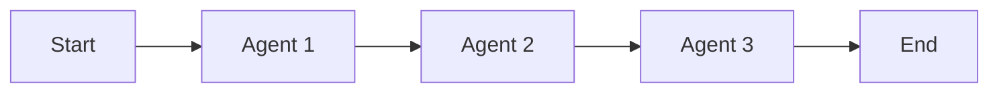
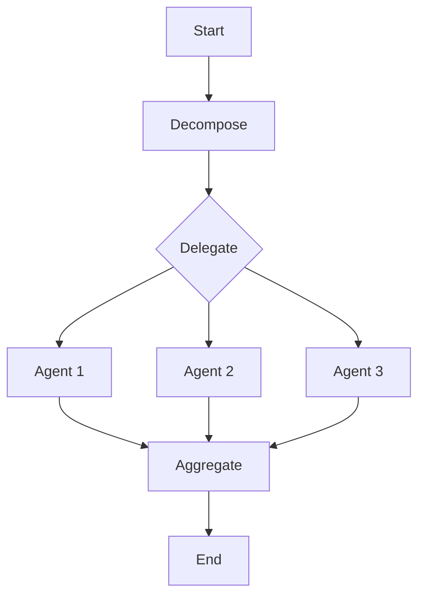
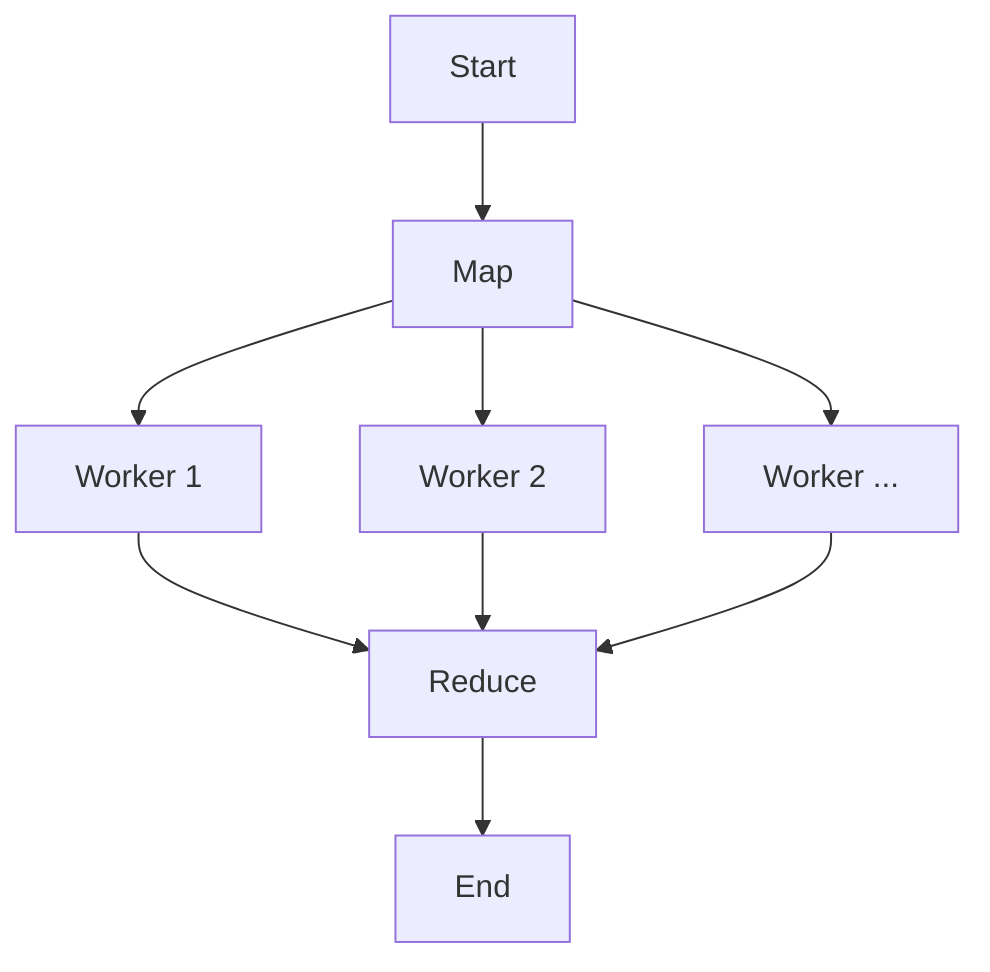

# Multi-Agent Workflows

This document describes the multi-agent workflow patterns implemented in Phase 6. These patterns enable agents to collaborate on complex tasks using LangGraph for state management and orchestration.

## Overview

The system supports three primary workflow patterns:

1.  **Sequential**: Agents execute tasks in a strict linear order.
2.  **Parallel**: Agents execute independent subtasks concurrently.
3.  **Map-Reduce**: Work is distributed to multiple workers and results are aggregated.

## 1. Sequential Workflow

**Use Case**: Pipelines where each step depends on the output of the previous step (e.g., Feature Dev -> Code Review -> CI/CD).

**Implementation**: `shared/services/langgraph/workflows/sequential.py`

**Structure**:



**Example Configuration**:

```python
steps = [
    {"name": "design", "agent": "feature-dev"},
    {"name": "implement", "agent": "feature-dev"},
    {"name": "review", "agent": "code-review"}
]
workflow = create_sequential_workflow(steps)
```

## 2. Parallel Workflow

**Use Case**: Tasks that can be broken down into independent subtasks (e.g., running different test suites, analyzing code from multiple perspectives).

**Implementation**: `shared/services/langgraph/workflows/parallel.py`

**Structure**:



**Key Components**:

- **Decompose**: Breaks the main task into subtasks (using LLM or rule-based logic).
- **Delegate**: Emits `task.delegated` events to assign subtasks to agents.
- **Aggregate**: Collects results from all agents once completed.

## 3. Map-Reduce Workflow

**Use Case**: Processing large datasets or lists of items where each item requires the same operation (e.g., refactoring 50 files, summarizing 20 documents).

**Implementation**: `shared/services/langgraph/workflows/map_reduce.py`

**Structure**:



## State Management

All workflows share a common state schema defined in `MultiAgentState`.

**Key Fields**:

- `task_id`: Unique identifier for the workflow.
- `subtasks`: List of decomposed tasks.
- `agent_assignments`: Mapping of subtask IDs to agent IDs.
- `partial_results`: Storage for intermediate results.
- `locks`: Distributed resource locks held by the workflow.

**Persistence**:
State is persisted to PostgreSQL (`workflow_state` table) with **optimistic locking** to prevent race conditions during concurrent updates.

## Usage

To start a workflow from the Orchestrator:

```python
from agent_orchestrator.workflows import WorkflowManager

manager = WorkflowManager(persistence)
await manager.start_workflow(
    workflow_type="parallel",
    task_id="task-123",
    initial_state={"subtasks": [...]}
)
```
