# code/chef Architecture

**Version:** v1.0  
**Last Updated:** December 9, 2025

See [../getting-started/quickstart.md](../getting-started/quickstart.md) for setup | [../getting-started/deployment.md](../getting-started/deployment.md) for deployment

---

## How code/chef Works

When you type `@chef Add authentication to my app`, here's what happens:

```mermaid
flowchart TB
    subgraph VSCode["🖥️ VS Code"]
        Chat["@chef Add JWT auth to my Express API"]
    end

    subgraph Orchestrator["🧑‍🍳 code/chef Orchestrator"]
        Supervisor["Supervisor\n(Head Chef)"]

        subgraph Agents["Specialized Agents"]
            FeatureDev["🚀 Feature Dev\nClaude 3.5"]
            CodeReview["🔍 Code Review\nGPT-4o"]
            CICD["⚡ CI/CD\nLlama 3.1"]
            Infra["🏗️ Infrastructure\nLlama 3.1"]
            Docs["📚 Documentation\nClaude 3.5"]
        end

        Tools["🔧 150+ MCP Tools"]
    end

    subgraph Integrations["External Services"]
        GitHub["🐙 GitHub"]
        Linear["📋 Linear"]
        Docker["🐳 Docker"]
        Metrics["📊 Metrics"]
    end

    Chat --> Supervisor
    Supervisor --> FeatureDev
    Supervisor --> CodeReview
    Supervisor --> CICD
    Supervisor --> Infra
    Supervisor --> Docs

    FeatureDev --> Tools
    CodeReview --> Tools
    CICD --> Tools
    Infra --> Tools
    Docs --> Tools

    Tools --> GitHub
    Tools --> Linear
    Tools --> Docker
    Tools --> Metrics
```

---

## The AI Team

code/chef uses specialized AI agents, each optimized for specific tasks:

### 🧑‍🍳 Supervisor (Head Chef)

**Model:** Claude 3.5 Sonnet via OpenRouter

The head chef who receives your request, breaks it down into subtasks, and coordinates the specialist agents. Handles complex multi-step workflows.

### 🚀 Feature Dev

**Model:** Claude 3.5 Sonnet via OpenRouter

Writes production-ready code. Understands your codebase context and generates code that matches your existing patterns, with tests.

### 🔍 Code Review

**Model:** GPT-4o via OpenRouter

Analyzes code for security vulnerabilities, performance issues, and best practices. Provides actionable feedback with specific line numbers.

### 🏗️ Infrastructure

**Model:** Llama 3.1 70B via OpenRouter

Creates Docker configurations, Terraform files, Kubernetes manifests, and other infrastructure-as-code. Cost-effective for configuration generation.

### ⚡ CI/CD

**Model:** Llama 3.1 70B via OpenRouter

Builds pipelines for GitHub Actions, GitLab CI, Jenkins, and more. Understands testing, deployment, and release workflows.

### 📚 Documentation

**Model:** Claude 3.5 Sonnet via OpenRouter

Writes README files, API documentation, architecture diagrams, and inline code comments. Excellent technical writing.

---

## Multi-Model Architecture

code/chef uses **OpenRouter** to access the best AI models for each task:

```mermaid
flowchart LR
    subgraph OpenRouter["☁️ OpenRouter Gateway"]
        direction TB
        API["Single API\n200+ Models\nAutomatic Fallback"]
    end

    subgraph Models["AI Models"]
        direction LR
        Claude["🟣 Claude 3.5 Sonnet\n• Code Generation\n• Documentation\n• Planning"]
        GPT["🟢 GPT-4o\n• Reasoning\n• Analysis\n• Code Review"]
        Llama["🔵 Llama 3.1 70B\n• Config Generation\n• Pipelines\n• Infrastructure"]
    end

    Request["Your Request"] --> OpenRouter
    OpenRouter --> Claude
    OpenRouter --> GPT
    OpenRouter --> Llama
```

### Why Multi-Model?

| Benefit                   | How it Helps                                                    |
| ------------------------- | --------------------------------------------------------------- |
| **Best tool for the job** | Claude for code, GPT-4o for analysis, Llama for cost efficiency |
| **Automatic failover**    | If one model is slow, another takes over                        |
| **Cost optimization**     | Use expensive models only when needed                           |
| **Real-time streaming**   | See responses as they're generated                              |

---

## Workflow Engine

code/chef uses pre-built workflows for common development patterns:

---

## Integrations

code/chef connects to 150+ tools through the **Model Context Protocol (MCP)**:

### Code & Files

- **Filesystem** — Read, write, search files
- **GitHub** — PRs, issues, actions, repos
- **Git** — Commits, branches, diffs

### Project Management

- **Linear** — Issues, projects, approvals
- **Notion** — Documentation, wikis

### Infrastructure

- **Docker** — Containers, images, compose
- **Kubernetes** — Coming soon

### Monitoring

- **Grafana** — Dashboards, alerts
- **Prometheus** — Metrics queries

---

## Human-in-the-Loop (HITL)

For high-risk operations, code/chef asks for approval:

```mermaid
flowchart LR
    subgraph Request["⚠️ Approval Required"]
        Action["Deploy to production"]
        Risk["Risk Level: High"]
        Details["• Affects 3 services\n• Database migration\n• ~2 min downtime"]
    end

    Request --> Decision{Approve?}
    Decision -->|Yes| Execute["✅ Execute"]
    Decision -->|No| Cancel["❌ Cancel"]
```

### Risk Assessment

| Risk Level   | Examples                    | Action                    |
| ------------ | --------------------------- | ------------------------- |
| **Low**      | Read files, generate docs   | Auto-execute              |
| **Medium**   | Create branches, open PRs   | Execute with notification |
| **High**     | Deploy, delete resources    | Require approval          |
| **Critical** | Production database changes | Multi-person approval     |

---

## Services Overview

When self-hosting, code/chef runs these services:

| Service          | Purpose                 | Port |
| ---------------- | ----------------------- | ---- |
| **Orchestrator** | Main API, all AI agents | 8001 |
| **RAG Context**  | Semantic code search    | 8007 |
| **State**        | Workflow persistence    | 8008 |
| **PostgreSQL**   | Database                | 5432 |

All services run in Docker containers via `docker-compose`.

---

## Security

### Data Handling

- Your code stays in your environment (self-hosted) or is encrypted in transit (hosted)
- API keys are never logged or stored in plain text
- HITL approvals provide human oversight for sensitive operations

### Access Control

- API key authentication for all requests
- Role-based access coming soon

---

## Related Documentation

- **[quickstart.md](../getting-started/quickstart.md)** — Installation and first steps
- **[deployment.md](../getting-started/deployment.md)** — Production deployment guide
- **[README](../../README.md)** — Feature overview
