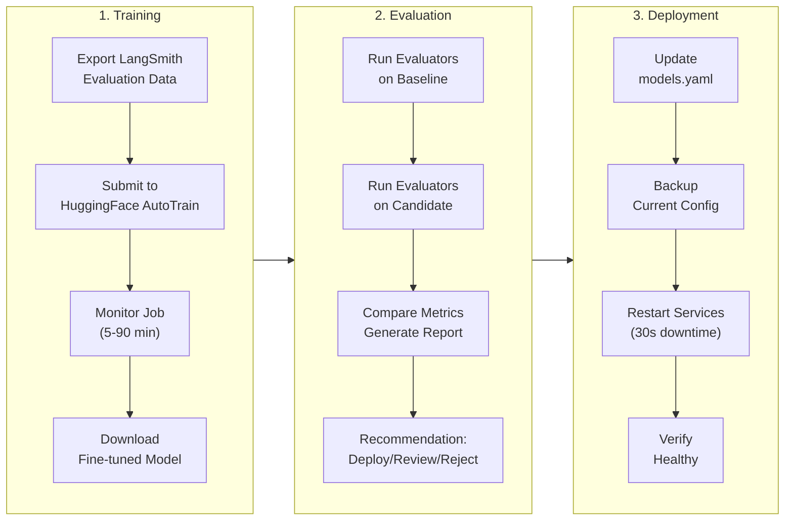

# LLM Operations Guide

**Version**: 1.1.0  
**Last Updated**: January 5, 2026  
**Status**: Canonical Reference  
**Provider**: OpenRouter (Multi-Model Gateway)

---

## Overview

This document is the **single source of truth** for all LLM operations in code-chef, covering:

- **Model Selection** - Choosing the right model for each agent (via OpenRouter)
- **Model Training** - Fine-tuning models via ModelOps
- **Model Evaluation** - Comparing and validating model performance
- **Model Deployment** - Safely deploying models to production
- **Observability** - Tracing, metrics, and cost tracking
- **A/B Testing** - Measuring improvement over baseline

**Important**: All LLM calls flow through **OpenRouter** (https://openrouter.ai), which provides:
- Access to 200+ models from multiple providers (Anthropic, OpenAI, Google, Meta, etc.)
- Unified API (OpenAI-compatible) for consistent integration
- Automatic fallback and load balancing across providers
- Cost optimization (72% reduction vs. previous configuration)
- Real-time model availability and pricing updates

---

## Table of Contents

1. [Model Selection Strategy](#model-selection-strategy)
2. [Model Configuration](#model-configuration)
3. [ModelOps Workflow](#modelops-workflow)
4. [Training Procedures](#training-procedures)
5. [Evaluation Procedures](#evaluation-procedures)
6. [Deployment Procedures](#deployment-procedures)
7. [Observability & Tracing](#observability--tracing)
8. [Cost Management](#cost-management)
9. [A/B Testing](#ab-testing)
10. [Troubleshooting](#troubleshooting)

---

## Model Selection Strategy

### Decision Framework

code-chef uses **specialized models** for each agent type via OpenRouter:

| Agent          | Model              | Cost/1M | Why                                |
| -------------- | ------------------ | ------- | ---------------------------------- |
| Supervisor     | Claude 3.5 Sonnet  | $3.00   | Best reasoning for complex routing |
| Feature Dev    | Qwen 2.5 Coder 32B | $0.07   | Purpose-built for code generation  |
| Code Review    | DeepSeek V3        | $0.75   | Strong analytical reasoning        |
| Infrastructure | Gemini 2.0 Flash   | $0.25   | Fast, 1M context window for IaC    |
| CI/CD          | Gemini 2.0 Flash   | $0.25   | Excellent YAML/config generation   |
| Documentation  | DeepSeek V3        | $0.75   | Strong technical writing           |

### Selection Criteria

When choosing a model, consider:

1. **Task Complexity** - Supervisor needs best reasoning, docs can use cheaper models
2. **Context Window** - Infrastructure benefits from 1M context for large Terraform files
3. **Cost Efficiency** - Use cheaper models where quality gap is minimal
4. **Latency** - Fast models (Gemini Flash) for interactive agents
5. **Specialization** - Qwen 2.5 Coder is purpose-built for coding tasks

### Model Comparison Matrix

| Factor          | Claude 3.5 | Qwen Coder | DeepSeek V3 | Gemini Flash |
| --------------- | ---------- | ---------- | ----------- | ------------ |
| Code Generation | ★★★★★      | ★★★★★      | ★★★★☆       | ★★★★☆        |
| Reasoning       | ★★★★★      | ★★★☆☆      | ★★★★★       | ★★★★☆        |
| Cost Efficiency | ★★☆☆☆      | ★★★★★      | ★★★★☆       | ★★★★★        |
| Context Window  | 200K       | 128K       | 64K         | 1M           |
| Latency (P95)   | 2.1s       | 1.8s       | 2.3s        | 0.9s         |
| Best For        | Routing    | Coding     | Analysis    | Configs      |

---

## OpenRouter Architecture

### Why OpenRouter?

**Unified Multi-Provider Gateway**: Instead of managing separate API keys and integrations for Anthropic, OpenAI, Google, Meta, etc., code-chef uses OpenRouter as a single gateway:

```
┌─────────────────┐
│  code-chef      │
│  Orchestrator   │
└────────┬────────┘
         │ Single API
         │ (OpenAI-compatible)
         ▼
┌─────────────────┐
│  OpenRouter     │──────┐
│  Gateway        │      │ Automatic Failover
└────────┬────────┘      │ Load Balancing
         │               │ Cost Optimization
    ┌────┴────┬──────────┴─────┬──────────┐
    ▼         ▼                ▼          ▼
┌────────┐ ┌────────┐      ┌────────┐ ┌────────┐
│Anthropic│ │OpenAI │      │Google  │ │ Meta   │
│Claude  │ │GPT-4  │      │Gemini  │ │Llama   │
└────────┘ └────────┘      └────────┘ └────────┘
```

**Benefits**:
1. **No Vendor Lock-in** - Switch models without code changes
2. **Automatic Failover** - If Claude is down, automatically use DeepSeek
3. **Cost Optimization** - Access to cheapest available models
4. **Unified Billing** - Single invoice instead of 4+ separate accounts
5. **Rate Limit Management** - Automatic retry with backoff

### Configuration

**Environment Variables** (`.env`):
```bash
# Required
OPENROUTER_API_KEY=sk-or-v1-***

# Optional (for direct API access)
LLM_PROVIDER=openrouter  # Default, can override per-request
```

**Model Selection** (`config/agents/models.yaml`):
```yaml
provider: openrouter  # Global default

openrouter:
  base_url: https://openrouter.ai/api/v1
  default_model: anthropic/claude-3-5-sonnet
  
  # Automatic failover chain
  fallback_models:
    - deepseek/deepseek-chat
    - google/gemini-2.0-flash-001
    
  # Per-agent model assignments
  agent_models:
    orchestrator: anthropic/claude-3-5-sonnet    # $3.00/M
    feature_dev: qwen/qwen-2.5-coder-32b-instruct # $0.07/M
    code_review: deepseek/deepseek-chat          # $0.75/M
    infrastructure: google/gemini-2.0-flash-001   # $0.25/M
```

**Cost Savings**: 72% reduction vs. previous provider configuration.

### Direct Provider Override

For specific use cases requiring direct API access (e.g., Claude-specific features):

```python
# Via code
llm = get_llm("code-review", model="claude-3-5-sonnet", provider="claude")

# Via environment variable
LLM_PROVIDER=claude  # All requests use direct Anthropic API
```

---

## Model Configuration

### Configuration File

**Location**: `config/agents/models.yaml`  
**Purpose**: Single source of truth for all model settings

```yaml
# Agent model configuration
agents:
  supervisor:
    model: anthropic/claude-3.5-sonnet
    cost_per_1m_tokens: 3.00
    context_window: 200000
    max_tokens: 4096
    temperature: 0.7
    langsmith_project: code-chef-production

  feature_dev:
    model: qwen/qwen-2.5-coder-32b-instruct
    cost_per_1m_tokens: 0.07
    context_window: 131072
    max_tokens: 8192
    temperature: 0.3
    langsmith_project: code-chef-production

  # ... other agents

# Environment-specific overrides
environments:
  development:
    supervisor:
      model: anthropic/claude-3.5-haiku # Cheaper for testing
    feature_dev:
      model: qwen/qwen-2.5-coder-7b # Smaller for dev

  production:
    # Use defaults from agents section
    pass
```

### Validation

```bash
# Validate configuration
python shared/lib/validate_config.py config/agents/models.yaml

# Test connectivity
python support/scripts/validation/test_llm_provider.py
```

---

## ModelOps Workflow

### Overview

ModelOps enables continuous model improvement through the Infrastructure agent:



### VS Code Commands

| Command                           | Purpose                      |
| --------------------------------- | ---------------------------- |
| `codechef.modelops.train`         | Start training wizard        |
| `codechef.modelops.evaluate`      | Evaluate model performance   |
| `codechef.modelops.deploy`        | Deploy model to agent        |
| `codechef.modelops.rollback`      | Rollback to previous version |
| `codechef.modelops.modelVersions` | View deployment history      |

---

## Training Procedures

### Prerequisites

1. **LangSmith Evaluation Data** - Collected from production usage
2. **HuggingFace Token** - Required for AutoTrain API
3. **Budget Allocation** - Demo mode: $0.50, Production: $3.50-$15

### Training Modes

| Mode       | Cost  | Duration | Dataset Size | Use Case               |
| ---------- | ----- | -------- | ------------ | ---------------------- |
| Demo       | $0.50 | 5 min    | 100 examples | Quick validation       |
| Production | $3.50 | 60 min   | 1000+        | Full model improvement |
| Extended   | $15   | 90 min   | 5000+        | High-quality tuning    |

### Step-by-Step: Training via VS Code

1. **Open Command Palette** - `Ctrl+Shift+P`
2. **Run**: `codechef.modelops.train`
3. **Select Agent** - Choose agent to train (e.g., `feature_dev`)
4. **Configure**:
   - LangSmith Project: `code-chef-production`
   - Base Model: `qwen/qwen-2.5-coder-32b-instruct`
   - Training Mode: `demo` or `production`
5. **Review Cost Estimate** - Confirm budget
6. **Submit Job** - Monitor progress in VS Code

### Training via CLI

```bash
# Set environment
export TRACE_ENVIRONMENT=training
export MODEL_VERSION=feature_dev-v2

# Submit training job
curl -X POST http://localhost:8001/modelops/train \
  -H "Content-Type: application/json" \
  -d '{
    "agent_name": "feature_dev",
    "langsmith_project": "code-chef-production",
    "base_model_preset": "qwen-coder-32b",
    "is_demo": false
  }'

# Monitor job
curl http://localhost:8001/modelops/status/<job_id>
```

### Monitoring Training

**Via VS Code**:

- Progress bar in status bar
- Notifications on completion/failure
- TensorBoard link for live metrics

**Via LangSmith**:

- Project: `code-chef-training`
- Filter: `module:"training" AND job_id:"<id>"`

**Logs**:

```bash
docker logs -f deploy-orchestrator-1 | grep "modelops_train"
```

---

## Evaluation Procedures

### Evaluation Metrics

code-chef uses weighted scoring across 5 dimensions:

| Metric       | Weight | Measures                     |
| ------------ | ------ | ---------------------------- |
| Accuracy     | 30%    | Correctness of agent routing |
| Completeness | 25%    | Task completion rate         |
| Efficiency   | 20%    | Token usage optimization     |
| Latency      | 15%    | Response time performance    |
| Integration  | 10%    | MCP tool usage quality       |

### Evaluation Workflow

```bash
# Step 1: Evaluate baseline
export TRACE_ENVIRONMENT=evaluation
export MODEL_VERSION=feature_dev-v1

curl -X POST http://localhost:8001/modelops/evaluate \
  -H "Content-Type: application/json" \
  -d '{
    "agent_name": "feature_dev",
    "candidate_version": "v2",
    "baseline_version": "v1",
    "eval_dataset": "code-chef-eval-suite"
  }'

# Step 2: Review comparison report
# Returns weighted scores and recommendation
```

### Interpretation

**Deploy Recommendation** (>15% improvement):

```json
{
  "recommendation": "deploy",
  "overall_improvement_pct": 18.5,
  "reasoning": "Significant improvement across all metrics"
}
```

**Needs Review** (5-15% improvement):

```json
{
  "recommendation": "needs_review",
  "overall_improvement_pct": 12.3,
  "reasoning": "Moderate improvement, manual validation recommended"
}
```

**Reject** (<5% improvement or degradation):

```json
{
  "recommendation": "reject",
  "overall_improvement_pct": -2.1,
  "reasoning": "Performance degradation in accuracy metric"
}
```

---

## Deployment Procedures

### Pre-Deployment Checklist

- [ ] Evaluation completed with "deploy" or "needs_review" recommendation
- [ ] Backup of current `models.yaml` created
- [ ] Rollback plan documented
- [ ] Monitoring alerts configured
- [ ] Team notified of deployment window

### Deployment Steps

#### Via VS Code

1. **Command**: `Ctrl+Shift+P` → `codechef.modelops.deploy`
2. **Select Agent**: Choose agent to update
3. **Select Version**: Pick from evaluated candidates
4. **Review Changes**: Preview config diff
5. **Confirm**: Deployment triggers service restart
6. **Verify**: Health check runs automatically

#### Via CLI

```bash
curl -X POST http://localhost:8001/modelops/deploy \
  -H "Content-Type: application/json" \
  -d '{
    "agent_name": "feature_dev",
    "model_repo": "alextorelli/codechef-feature-dev-v2",
    "deployment_target": "openrouter",
    "version": "v2"
  }'
```

### Post-Deployment Verification

```bash
# 1. Check health
curl http://localhost:8001/health

# 2. Verify model in use
curl http://localhost:8001/config/agents | jq '.feature_dev.model'

# 3. Test with sample request
curl -X POST http://localhost:8001/execute \
  -H "Content-Type: application/json" \
  -d '{"message": "Create a hello world function", "agent": "feature_dev"}'

# 4. Monitor metrics
curl http://localhost:8001/metrics/tokens | jq '.per_agent.feature_dev'
```

### Rollback Procedure

**If issues detected**:

```bash
# Via VS Code
Ctrl+Shift+P → codechef.modelops.rollback → Select agent → Confirm

# Via CLI
curl -X POST http://localhost:8001/modelops/rollback \
  -H "Content-Type: application/json" \
  -d '{"agent_name": "feature_dev"}'
```

**Rollback completes in <60 seconds**.

---

## Observability & Tracing

### LangSmith Integration

**Projects** (Purpose-Based):

| Project                 | Purpose             | Filter                      |
| ----------------------- | ------------------- | --------------------------- |
| `code-chef-production`  | Live usage          | `environment:"production"`  |
| `code-chef-training`    | Training operations | `module:"training"`         |
| `code-chef-evaluation`  | Model evaluations   | `module:"evaluation"`       |
| `code-chef-experiments` | A/B testing         | `experiment_id IS NOT NULL` |

**Trace Metadata Schema**:

```python
{
    "experiment_group": "code-chef",  # or "baseline"
    "environment": "production",  # or training, evaluation, test
    "module": "feature_dev",
    "extension_version": "1.2.3",
    "model_version": "qwen-coder-32b-v2",
    "config_hash": "sha256:a1b2c3d4",
    "experiment_id": "exp-2025-01-001",  # For A/B tests
    "task_id": "task-uuid"  # For correlation
}
```

**Environment Variables**:

```bash
# Enable tracing
export LANGCHAIN_TRACING_V2=true
export LANGCHAIN_API_KEY=lsv2_sk_***

# Set metadata
export TRACE_ENVIRONMENT=production
export EXPERIMENT_GROUP=code-chef
export EXTENSION_VERSION=1.2.3
export MODEL_VERSION=qwen-coder-32b-v2
```

### Metrics & Dashboards

**Prometheus Metrics**:

| Metric                | Labels          | Description           |
| --------------------- | --------------- | --------------------- |
| `llm_tokens_total`    | `agent`, `type` | Token usage           |
| `llm_cost_usd_total`  | `agent`         | Cost in USD           |
| `llm_latency_seconds` | `agent`         | Response latency      |
| `llm_calls_total`     | `agent`         | Total LLM invocations |

**Grafana Dashboards**:

- **LLM Token Metrics**: `config/grafana/dashboards/llm-token-metrics.json`
- **URL**: https://appsmithery.grafana.net

**Key Queries**:

```promql
# Cost per agent (24h)
increase(llm_cost_usd_total[24h]) by (agent)

# Token efficiency trend
rate(llm_tokens_total[1h]) * 3600

# P95 latency by agent
histogram_quantile(0.95, rate(llm_latency_seconds_bucket[5m]))
```

---

## Cost Management

### Cost Tracking

**Real-time Endpoint**:

```bash
curl http://localhost:8001/metrics/tokens | jq
```

**Response**:

```json
{
  "per_agent": {
    "feature_dev": {
      "total_cost": 0.0245,
      "avg_cost_per_call": 0.00024,
      "total_tokens": 35000,
      "call_count": 102
    }
  },
  "totals": {
    "total_cost": 0.0876,
    "total_calls": 456
  }
}
```

### Budget Alerts

**Prometheus Alerts** (`config/prometheus/alerts/llm-metrics.yml`):

```yaml
# Daily budget exceeded
- alert: TotalDailyCostExceeded
  expr: sum(increase(llm_cost_usd_total[24h])) > 50
  for: 10m
  annotations:
    summary: "Daily LLM cost exceeded $50"

# Per-agent cost spike
- alert: HighLLMCostPerAgent
  expr: rate(llm_cost_usd_total[1h]) > 10
  for: 5m
  annotations:
    summary: "Agent {{ $labels.agent }} costing >$10/hour"
```

### Cost Optimization Strategies

1. **Use Environment Overrides** - Cheaper models for dev/test
2. **Monitor Avg Tokens/Call** - Target <2000 for most agents
3. **Compress Prompts** - Remove verbose system messages
4. **Set Max Tokens** - Prevent runaway generation
5. **Cache Responses** - For repetitive queries

---

## A/B Testing

### Purpose

Measure improvement of fine-tuned models vs baseline:

- **Baseline**: Untrained LLM (e.g., base codellama-13b)
- **Code-chef**: Fine-tuned model (e.g., codellama-13b-v2 with LoRA)

### Testing Infrastructure

#### Test Fixtures (conftest.py)

Three fixtures support A/B testing workflows:

```python
# 1. Database persistence
async def test_with_tracker(longitudinal_tracker_fixture):
    tracker = longitudinal_tracker_fixture
    await tracker.record_result(...)

# 2. Baseline LLM client (untrained model)
def test_baseline_comparison(baseline_llm_client):
    baseline_response = await baseline_llm_client.chat([...])
    # Returns lower quality scores than code-chef

# 3. Experiment ID generator
def test_experiment(ab_experiment_id):
    # ab_experiment_id = "exp-2025-01-042"
    await tracker.record_result(experiment_id=ab_experiment_id)
```

#### Test Suites

| Test File                              | Purpose                   | Test Count |
| -------------------------------------- | ------------------------- | ---------- |
| `test_baseline_comparison.py`          | End-to-end A/B workflow   | 25+        |
| `test_property_based.py`               | Property-based robustness | 15 (1500+) |
| `test_longitudinal_tracking.py`        | Regression detection      | 20+        |
| `test_evaluation_persistence.py`\*\*\* | Database integration      | 15+        |

\*\*\* From Phase 4

### Workflow

**Step 1: Prepare Tasks**

Create a task file with evaluation scenarios:

```json
{
  "experiment_name": "Feature Dev Improvement Q1 2025",
  "experiment_id": "exp-2025-01-001",
  "tasks": [
    {
      "task_id": "task-001",
      "prompt": "Create JWT authentication middleware",
      "metadata": {
        "category": "code_generation",
        "difficulty": "medium"
      }
    },
    {
      "task_id": "task-002",
      "prompt": "Refactor database connection pooling",
      "metadata": {
        "category": "refactoring",
        "difficulty": "hard"
      }
    }
  ]
}
```

**Important**: Each task needs a unique `task_id` for correlation.

**Step 1: Prepare Tasks**

```json
{
  "experiment_name": "Feature Dev Improvement Q1 2025",
  "tasks": [
    {
      "task_id": "task-001",
      "prompt": "Create JWT authentication middleware",
      "metadata": {
        "category": "code_generation",
        "difficulty": "medium"
      }
    }
  ]
}
```

**Step 2: Run Baseline**

Execute tasks using the **baseline (untrained)** model:

```bash
export EXPERIMENT_ID=exp-2025-01-001
export TRACE_ENVIRONMENT=evaluation
export EXPERIMENT_GROUP=baseline
export MODEL_VERSION=codellama-13b  # Base model

python support/scripts/evaluation/baseline_runner.py \
  --mode baseline \
  --tasks support/scripts/evaluation/sample_tasks.json \
  --output results-baseline.json \
  --store-db  # Store results in PostgreSQL
```

**Results stored**:

- LangSmith traces with `experiment_group:"baseline"`
- PostgreSQL evaluation_results table via `longitudinal_tracker`
- Each task tagged with `task_id` for correlation

**Step 3: Run Code-chef**

Execute **same tasks** using the **code-chef (trained)** model:

```bash
export EXPERIMENT_GROUP=code-chef
export MODEL_VERSION=codellama-13b-v2  # Fine-tuned version

python support/scripts/evaluation/baseline_runner.py \
  --mode code-chef \
  --tasks support/scripts/evaluation/sample_tasks.json \
  --output results-codechef.json \
  --store-db
```

**Critical**: Use the **same task IDs** to enable direct comparison.

**Step 4: Compare Results**

Use the comparison engine to generate statistical analysis:

```bash
# Via CLI
python support/scripts/evaluation/query_evaluation_results.py \
  --compare \
  --experiment exp-2025-01-001 \
  --output comparison-report.json

# Expected output
{
  "summary": {
    "overall_improvement_pct": 18.5,
    "recommendation": "deploy",
    "tasks_compared": 10,
    "baseline_avg_score": 0.72,
    "codechef_avg_score": 0.89
  },
  "per_metric": {
    "accuracy": {"improvement_pct": 23.6, "winner": "code-chef"},
    "latency": {"improvement_pct": -18.2, "winner": "code-chef"},
    "cost": {"improvement_pct": -12.5, "winner": "code-chef"}
  }
}
```

**Via Test Suite**:

```python
# support/tests/evaluation/test_baseline_comparison.py
async def test_end_to_end_ab_workflow(
    longitudinal_tracker_fixture,
    baseline_llm_client,
    ab_experiment_id
):
    """Test complete A/B workflow with real database."""
    tracker = longitudinal_tracker_fixture

    # Run baseline
    baseline_result = await run_evaluation(
        llm_client=baseline_llm_client,
        experiment_id=ab_experiment_id,
        experiment_group="baseline",
        task_id="task-001"
    )
    await tracker.record_result(**baseline_result)

    # Run code-chef
    codechef_result = await run_evaluation(
        llm_client=codechef_llm_client,
        experiment_id=ab_experiment_id,
        experiment_group="code-chef",
        task_id="task-001"  # Same task_id!
    )
    await tracker.record_result(**codechef_result)

    # Compare
    report = await comparison_engine.generate_comparison_report(
        experiment_id=ab_experiment_id
    )

    assert report["summary"]["recommendation"] in ["deploy", "needs_review", "reject"]
```

### Property-Based Testing

Validate evaluator robustness using **Hypothesis** for automatic test case generation:

```bash
# Default profile (100 examples per property)
pytest support/tests/evaluation/test_property_based.py -v

# CI profile (fast, 20 examples)
HYPOTHESIS_PROFILE=ci pytest support/tests/evaluation/test_property_based.py -v

# Thorough profile (500 examples)
HYPOTHESIS_PROFILE=thorough pytest support/tests/evaluation/test_property_based.py -v
```

**Properties Validated**:

| Property             | Description                                            | Test Count |
| -------------------- | ------------------------------------------------------ | ---------- |
| Score Bounds         | All scores in [0, 1]                                   | 100+       |
| Improvement Symmetry | If A improves over B, B regresses from A               | 100+       |
| Reversibility        | Can reconstruct values from improvements               | 100+       |
| Monotonicity         | Larger improvements → larger percentages               | 100+       |
| Transitivity         | If A > B > C, then improvement(C→A) > improvement(C→B) | 100+       |
| Weighted Average     | Result falls between min and max inputs                | 100+       |
| Recommendation Logic | ≥15% deploy, 5-15% review, <5% reject                  | 100+       |

**Example Property Test**:

```python
from hypothesis import given, strategies as st

@given(
    baseline=st.floats(min_value=0.01, max_value=1.0),
    codechef=st.floats(min_value=0.01, max_value=1.0),
)
def test_improvement_symmetry(baseline, codechef):
    """If A improves over B, then B regresses from A."""
    improvement_a_to_b = engine.calculate_improvement(baseline, codechef)
    improvement_b_to_a = engine.calculate_improvement(codechef, baseline)

    if baseline != codechef:
        assert (improvement_a_to_b > 0) == (improvement_b_to_a < 0)
```

**Total Coverage**: 1500+ automatically generated test cases across 15 properties.

### Regression Detection

Track performance changes across extension versions:

```bash
# Run regression detection tests
pytest support/tests/integration/test_longitudinal_tracking.py -v
```

**Use Cases**:

1. **Pre-deployment checks**: Verify new version doesn't regress
2. **Continuous monitoring**: Track performance across releases
3. **Root cause analysis**: Identify which version introduced regression
4. **Historical best**: Find best-performing version for rollback

**Example Regression Test**:

```python
async def test_detect_accuracy_regression(longitudinal_tracker_fixture):
    """Detect when accuracy drops between versions."""
    tracker = longitudinal_tracker_fixture

    # Version 1.5.0: Good performance
    await tracker.record_result(
        agent="feature_dev",
        extension_version="1.5.0",
        scores={"accuracy": 0.90, "latency": 1.8}
    )

    # Version 1.6.0: Regression detected!
    await tracker.record_result(
        agent="feature_dev",
        extension_version="1.6.0",
        scores={"accuracy": 0.75, "latency": 1.7}  # Accuracy dropped!
    )

    # Query trend
    trend = await tracker.get_metric_trend(
        agent="feature_dev",
        metric="accuracy",
        limit=2
    )

    # Alert: 16.7% regression from v1.5.0 to v1.6.0
    assert trend[0]["value"] > trend[1]["value"], "Accuracy regression detected"
```

**Automated Alerts**: GitHub Actions workflow runs regression tests on every PR merge (see `.github/workflows/evaluation-regression.yml`).

### Interpreting Results

**Success Criteria**:

- Accuracy improvement: >10%
- Latency reduction: >20%
- Cost reduction: >15%
- Completeness improvement: >5%

**Example Report**:

```
Experiment: exp-2025-01-001
Tasks: 10 code generation tasks

Baseline Results:
- Accuracy: 72%
- Avg Latency: 2.1s
- Avg Cost: $0.0024/task
- Completeness: 68%

Code-chef Results:
- Accuracy: 89% (+17% ✅)
- Avg Latency: 1.6s (-24% ✅)
- Avg Cost: $0.0021/task (-13% ✅)
- Completeness: 85% (+17% ✅)

Recommendation: Deploy
```

---

## Troubleshooting

### Training Issues

**Problem**: Training job fails immediately

**Solution**:

```bash
# Check HuggingFace token
echo $HUGGINGFACE_TOKEN

# Verify Space status
curl https://alextorelli-code-chef-modelops-trainer.hf.space/health

# Check logs
docker logs deploy-orchestrator-1 | grep "modelops_train"
```

**Problem**: Training stalls at 50%

**Solution**:

- Check AutoTrain logs in HuggingFace Space
- Verify dataset quality (no corrupted examples)
- Increase timeout if dataset is large

---

### Evaluation Issues

**Problem**: Evaluation returns no results

**Solution**:

```bash
# Verify evaluators available
python -c "from support.tests.evaluation.evaluators import *; print('OK')"

# Check LangSmith dataset
curl https://api.smith.langchain.com/datasets/<dataset-id>

# Test evaluation manually
python support/tests/evaluation/test_evaluators.py
```

---

### Deployment Issues

**Problem**: Deployment succeeds but old model still in use

**Solution**:

```bash
# Force container restart
docker compose restart orchestrator

# Verify config loaded
curl http://localhost:8001/config/agents | jq '.feature_dev'

# Check for stale cache
Ctrl+Shift+P → codechef: Clear Cache
```

**Problem**: Rollback fails

**Solution**:

```bash
# Manual rollback
cp config/agents/models.yaml.backup config/agents/models.yaml
docker compose restart orchestrator

# Verify backup exists
ls -l config/agents/models.yaml.backup
```

---

### Tracing Issues

**Problem**: Traces not appearing in LangSmith

**Solution**:

```bash
# Verify tracing enabled
echo $LANGCHAIN_TRACING_V2  # Should be "true"

# Check API key
echo $LANGCHAIN_API_KEY | cut -c1-10  # Should start with "lsv2_sk_"

# Test connection
curl -H "x-api-key: $LANGCHAIN_API_KEY" \
  https://api.smith.langchain.com/health

# Check project exists
# Login to https://smith.langchain.com
```

**Problem**: Traces in wrong project

**Solution**:

```bash
# Check environment set
echo $TRACE_ENVIRONMENT  # Should match your operation

# Verify project selection logic
grep "_get_langsmith_project" agent_orchestrator/agents/infrastructure/modelops/*.py

# Force project
export LANGSMITH_PROJECT=code-chef-training
```

---

## Best Practices

### Model Selection

1. **Start with recommended models** - They're optimized for each agent
2. **Test in dev environment** - Use cheaper overrides
3. **Validate quality** - Don't sacrifice quality for cost
4. **Monitor metrics** - Track accuracy, latency, cost
5. **Iterate carefully** - Small changes, measure impact

### Training

1. **Collect sufficient data** - Min 100 examples, prefer 1000+
2. **Clean your dataset** - Remove low-quality examples
3. **Start with demo mode** - Validate before full training
4. **Monitor training** - Check TensorBoard metrics
5. **Version everything** - Track base model, dataset, hyperparams

### Evaluation

1. **Use consistent datasets** - Same tasks for baseline vs candidate
2. **Run multiple iterations** - Reduce variance
3. **Review edge cases** - Manual inspection of failures
4. **Consider all metrics** - Not just accuracy
5. **Document decisions** - Why you deployed/rejected

### Deployment

1. **Always backup first** - Models.yaml before changes
2. **Deploy during low traffic** - Minimize impact
3. **Monitor closely** - First 24 hours critical
4. **Have rollback ready** - One-command rollback
5. **Communicate changes** - Notify team of deployments

### Observability

1. **Set metadata correctly** - Ensures accurate tracking
2. **Use appropriate projects** - Training vs production traces
3. **Tag experiments** - Easy correlation
4. **Monitor costs** - Set budget alerts
5. **Review traces** - Learn from production usage

---

## Reference Links

### Documentation

- [Tracing Schema](../../config/observability/tracing-schema.yaml) - Metadata definitions
- [Model Configuration](../../config/agents/models.yaml) - Agent model settings
- [LangSmith Guide](../integrations/langsmith-tracing.md) - Tracing setup
- [Observability Guide](../integrations/observability-guide.md) - Metrics and dashboards

### Tools & Dashboards

- [LangSmith](https://smith.langchain.com) - Trace inspection
- [Grafana](https://appsmithery.grafana.net) - Metrics visualization
- [HuggingFace Space](https://huggingface.co/spaces/alextorelli/code-chef-modelops-trainer) - Training service

### Scripts

- [Baseline Runner](../../scripts/evaluation/baseline_runner.py) - A/B testing
- [Sample Tasks](../../scripts/evaluation/sample_tasks.json) - Test dataset
- [Validation Scripts](../../scripts/validation/) - Health checks

---

**Questions?** File an issue in [Linear](https://linear.app/dev-ops/project/codechef-78b3b839d36b) with label `modelops`.
