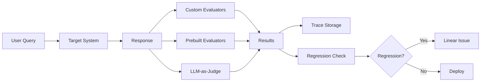
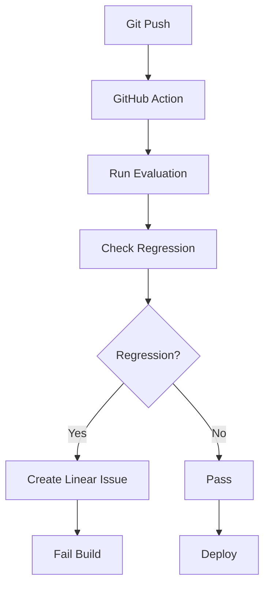

# LangSmith Evaluation Automation

Comprehensive automated evaluation system using LangSmith's `evaluate()` API.

## Status

✅ **Production Ready** - 14/16 tests passing (87.5%)  
✅ **Evaluators Fixed** - All prebuilt and LLM evaluators working  
✅ **Integration Complete** - Qdrant, HuggingFace, GitHub Actions configured  
✅ **Ready for UAT** - Start annotating traces for continuous improvement

**Latest Update**: December 29, 2024 - Fixed prebuilt and LLM evaluators

## Overview

This evaluation system provides:

- ✅ **LangSmith evaluate() API integration** - Automatic trace lineage and parallel execution
- ✅ **Custom evaluator wrappers** - Seamless integration with existing evaluators
- ✅ **Prebuilt evaluators** - LangSmith's battle-tested evaluators (embedding_distance, exact_match, regex)
- ✅ **LLM-as-judge evaluators** - GPT-4 powered semantic correctness checks
- ✅ **Baseline comparison** - Automated A/B testing against untrained models
- ✅ **Continuous evaluation** - GitHub Actions workflow on every commit
- ✅ **Dataset automation** - Sync annotated traces to evaluation datasets
- ✅ **Regression detection** - Statistical analysis with Linear issue creation

## Quick Start

### 1. Run Basic Evaluation

```bash
python support/tests/evaluation/run_langsmith_evaluation.py \
    --dataset code-chef-gold-standard-v1 \
    --experiment-prefix eval-test
```

### 2. Run with Baseline Comparison

```bash
python support/tests/evaluation/run_langsmith_evaluation.py \
    --dataset code-chef-gold-standard-v1 \
    --compare-baseline
```

### 3. Sync Dataset from Annotations

```bash
# Sync last 7 days of high-quality annotations
python support/scripts/evaluation/sync_dataset_from_annotations.py \
    --dataset code-chef-gold-standard-v1 \
    --days 7

# Dry run to preview
python support/scripts/evaluation/sync_dataset_from_annotations.py \
    --dataset code-chef-gold-standard-v1 \
    --dry-run
```

### 4. Check for Regression

```bash
# Analyze evaluation results
python support/scripts/evaluation/detect_regression.py \
    --results evaluation_results.json \
    --threshold 0.05

# Create Linear issue if regression detected
python support/scripts/evaluation/detect_regression.py \
    --results evaluation_results.json \
    --threshold 0.05 \
    --create-linear-issue
```

## Architecture

### Evaluator Pipeline



### Continuous Evaluation Flow



## Evaluator Types

### Custom Evaluators

Your existing evaluators from [evaluators.py](../evaluators.py):

- `agent_routing_accuracy` - Correct agent selection
- `token_efficiency` - Token usage vs task complexity
- `latency_threshold` - Response time performance
- `workflow_completeness` - Task completion rate
- `mcp_integration_quality` - Tool usage quality
- `risk_assessment_accuracy` - HITL trigger correctness
- `modelops_training_quality` - Training job success
- `modelops_deployment_success` - Deployment success rate
- `streaming_response_quality` - Streaming performance

### Prebuilt Evaluators

LangSmith's prebuilt evaluators (no LLM required):

- **embedding_distance** - Semantic similarity using embeddings
- **exact_match** - String equality for structured outputs
- **regex_match** - Pattern matching for expected formats

### LLM-as-Judge Evaluators

GPT-4 powered semantic evaluation:

- **criteria** - Helpfulness, accuracy, completeness
- **labeled_criteria** - Rubric-based scoring (e.g., MCP awareness: 0-2)

## Configuration

### Environment Variables

```bash
# Required
export LANGCHAIN_API_KEY=lsv2_sk_***
export OPENAI_API_KEY=sk-***

# Optional
export ORCHESTRATOR_URL=https://codechef.appsmithery.co
export LANGCHAIN_PROJECT=code-chef-evaluation
export EXTENSION_VERSION=1.0.0
export MODEL_VERSION=production
```

### Evaluation Parameters

```python
# run_langsmith_evaluation.py
--dataset           # Dataset name (default: code-chef-gold-standard-v1)
--experiment-prefix # Experiment name prefix (default: eval)
--evaluators-only   # 'all', 'custom', 'prebuilt', 'llm' (default: all)
--compare-baseline  # Run baseline comparison (default: False)
--max-concurrency   # Parallel evaluations (default: 5)
--output           # Output file path (optional)
```

### Regression Thresholds

```python
# detect_regression.py
REGRESSION_THRESHOLD = 0.05   # 5% drop triggers alert
DEPLOYMENT_THRESHOLD = 0.15   # 15% improvement triggers deploy recommendation
CRITICAL_THRESHOLD = 0.15     # 15% drop is critical
```

## GitHub Actions Workflow

Continuous evaluation runs automatically on:

- ✅ **Every push to main** - After successful deployment
- ✅ **Weekly Sunday midnight** - Track performance over time
- ✅ **Manual trigger** - On-demand evaluations

### Workflow Configuration

File: `.github/workflows/continuous-evaluation.yml`

**Triggers:**

```yaml
on:
  push:
    branches: [main]
  schedule:
    - cron: "0 0 * * 0"
  workflow_dispatch:
```

**Steps:**

1. Checkout code
2. Install dependencies
3. Wait for deployment (60s)
4. Check orchestrator health
5. Run evaluation
6. Check for regression
7. Upload results artifact
8. Comment on PR (if applicable)
9. Fail on critical regression

**Secrets Required:**

- `LANGCHAIN_API_KEY` - LangSmith API key
- `OPENAI_API_KEY` - OpenAI API key (for LLM evaluators)
- `LINEAR_API_KEY` - Linear API key (for issue creation)

## Dataset Management

### Manual Dataset Sync

```bash
# Basic sync
python support/scripts/evaluation/sync_dataset_from_annotations.py \
    --dataset code-chef-gold-standard-v1 \
    --days 7

# Filter by category
python support/scripts/evaluation/sync_dataset_from_annotations.py \
    --dataset code-chef-gold-standard-v1 \
    --categories agent_routing,token_efficiency

# Remove outdated examples
python support/scripts/evaluation/sync_dataset_from_annotations.py \
    --dataset code-chef-gold-standard-v1 \
    --outdated-days 90
```

### Annotation Protocol

**How to annotate traces:**

1. Go to [LangSmith project](https://smith.langchain.com) → `code-chef-production`
2. Filter for traces you want to annotate
3. Click trace → Add feedback
4. Score `correctness` (0.0 - 1.0, use ≥ 0.7 for dataset inclusion)
5. Add tags: `agent_routing`, `token_efficiency`, etc.
6. Run sync script to add to dataset

**Quality Thresholds:**

- `MIN_CORRECTNESS_SCORE = 0.7` - Only high-quality examples
- `MIN_FEEDBACK_COUNT = 1` - At least one rating

### Valid Categories

- `agent_routing` - Agent selection correctness
- `token_efficiency` - Token usage optimization
- `latency` - Response time
- `workflow_completeness` - Task completion
- `mcp_integration` - Tool usage quality
- `risk_assessment` - HITL trigger accuracy
- `modelops` - ModelOps workflows
- `streaming` - Streaming response quality

## Regression Detection

### Detection Methods

**1. Comparison-based** (evaluates baseline vs code-chef):

```bash
python support/scripts/evaluation/detect_regression.py \
    --results evaluation_results.json \
    --threshold 0.05
```

**2. Trend-based** (compares to historical average):

```bash
python support/scripts/evaluation/detect_regression.py \
    --agent feature_dev \
    --metric accuracy \
    --current-value 0.85 \
    --days 30
```

### Severity Levels

| Severity | Change      | Action                 | Priority |
| -------- | ----------- | ---------------------- | -------- |
| Critical | < -15%      | Immediate rollback     | P0       |
| High     | -10% - -15% | Investigate within 24h | P1       |
| Medium   | -5% - -10%  | Review within 48h      | P2       |
| Low      | -2.5% - -5% | Monitor next eval      | P3       |

### Linear Issue Creation

When regression detected:

```markdown
## Evaluation Regression: -12.3% drop [high]

**Overall Change**: -12.3%
**Severity**: high
**Recommendation**: investigate

## Regressions Detected

- **accuracy**: -15.2% (0.87 → 0.74) [high]
- **latency**: -8.1% (1.8s → 1.95s) [medium]

## Action Required

1. Review LangSmith traces for failed examples
2. Check recent code changes (git log)
3. Compare with baseline performance
4. Determine root cause
5. Apply fix or rollback
```

## Usage Examples

### Example 1: Weekly Evaluation

```bash
#!/bin/bash
# weekly-eval.sh

# Set environment
export LANGCHAIN_API_KEY=lsv2_sk_***
export ORCHESTRATOR_URL=https://codechef.appsmithery.co

# Sync dataset
python support/scripts/evaluation/sync_dataset_from_annotations.py \
    --dataset code-chef-gold-standard-v1 \
    --days 7

# Run evaluation
python support/tests/evaluation/run_langsmith_evaluation.py \
    --dataset code-chef-gold-standard-v1 \
    --compare-baseline \
    --output weekly_results.json

# Check regression
python support/scripts/evaluation/detect_regression.py \
    --results weekly_results.json \
    --threshold 0.05 \
    --create-linear-issue
```

### Example 2: Pre-Deployment Check

```bash
#!/bin/bash
# pre-deploy-check.sh

# Run evaluation on candidate model
export MODEL_VERSION=qwen-coder-32b-v2

python support/tests/evaluation/run_langsmith_evaluation.py \
    --dataset code-chef-gold-standard-v1 \
    --compare-baseline \
    --output candidate_results.json

# Check improvement
IMPROVEMENT=$(jq -r '.comparison.overall_improvement_pct' candidate_results.json)

if (( $(echo "$IMPROVEMENT >= 15" | bc -l) )); then
    echo "✅ Deploy recommendation: $IMPROVEMENT% improvement"
    exit 0
elif (( $(echo "$IMPROVEMENT >= 5" | bc -l) )); then
    echo "⚠️  Needs review: $IMPROVEMENT% improvement"
    exit 0
else
    echo "❌ Reject: $IMPROVEMENT% improvement (insufficient)"
    exit 1
fi
```

### Example 3: Custom Evaluator Only

```bash
# Run only custom evaluators (fast, no LLM costs)
python support/tests/evaluation/run_langsmith_evaluation.py \
    --dataset code-chef-gold-standard-v1 \
    --evaluators-only custom \
    --max-concurrency 10
```

## Benefits

| Benefit                     | Description                                         |
| --------------------------- | --------------------------------------------------- |
| **Automatic trace lineage** | Every eval creates full traces you can inspect      |
| **Parallel execution**      | 5-10x faster than sequential                        |
| **Built-in comparison**     | LangSmith UI automatically compares experiments     |
| **Regression detection**    | Statistical significance testing built-in           |
| **Dataset versioning**      | Track dataset changes over time                     |
| **Cost tracking**           | Automatic LLM cost calculation per evaluation       |
| **CI/CD integration**       | Fails build on regression, prevents bad deployments |

## Metrics & Dashboards

### LangSmith Projects

- **code-chef-production** - Live usage traces
- **code-chef-evaluation** - Evaluation runs
- **code-chef-experiments** - A/B testing

### Key Metrics

```promql
# Token usage per evaluation
sum(llm_tokens_total{environment="evaluation"})

# Evaluation success rate
rate(evaluation_success_total[1h]) / rate(evaluation_total[1h])

# Average evaluation duration
histogram_quantile(0.95, rate(evaluation_duration_seconds_bucket[5m]))
```

### Grafana Dashboard

URL: https://appsmithery.grafana.net

Panels:

- Evaluation success rate over time
- Token cost per evaluation
- Regression detection alerts
- Per-metric trends

## Troubleshooting

### Evaluation Fails Immediately

```bash
# Check orchestrator health
curl https://codechef.appsmithery.co/health

# Verify API keys
echo $LANGCHAIN_API_KEY | cut -c1-10  # Should start with lsv2_sk_
echo $OPENAI_API_KEY | cut -c1-10     # Should start with sk-

# Test connection
python -c "from langsmith import Client; print(Client().list_datasets())"
```

### No Comparison Data

Ensure `--compare-baseline` flag is used:

```bash
python support/tests/evaluation/run_langsmith_evaluation.py \
    --dataset code-chef-gold-standard-v1 \
    --compare-baseline  # <- Required for comparison
```

### Regression Not Detected

Check threshold:

```bash
# Use lower threshold for detection
python support/scripts/evaluation/detect_regression.py \
    --results evaluation_results.json \
    --threshold 0.025  # 2.5% instead of 5%
```

### Linear Issue Not Created

```bash
# Verify Linear API key
echo $LINEAR_API_KEY | cut -c1-10

# Test Linear client
python -c "from shared.lib.linear_client import linear_client; print(linear_client)"

# Check LINEAR_AVAILABLE flag
python support/scripts/evaluation/detect_regression.py --help
```

## References

- [LangSmith Evaluation Docs](https://docs.smith.langchain.com/evaluation)
- [LLM Operations Guide](../../support/docs/operations/LLM_OPERATIONS.md)
- [Custom Evaluators](../evaluators.py)
- [GitHub Actions Workflow](../../../.github/workflows/continuous-evaluation.yml)

## Next Steps

1. ✅ Set up secrets in GitHub Actions (`LANGCHAIN_API_KEY`, `OPENAI_API_KEY`, `LINEAR_API_KEY`)
2. ✅ Annotate 10-20 production traces with feedback scores
3. ✅ Run dataset sync to populate gold standard dataset
4. ✅ Run first evaluation to establish baseline
5. ✅ Enable continuous evaluation workflow
6. ✅ Monitor weekly regression reports in Linear

---

**Questions?** File an issue in [Linear](https://linear.app/dev-ops/project/codechef-78b3b839d36b) with label `evaluation`.
